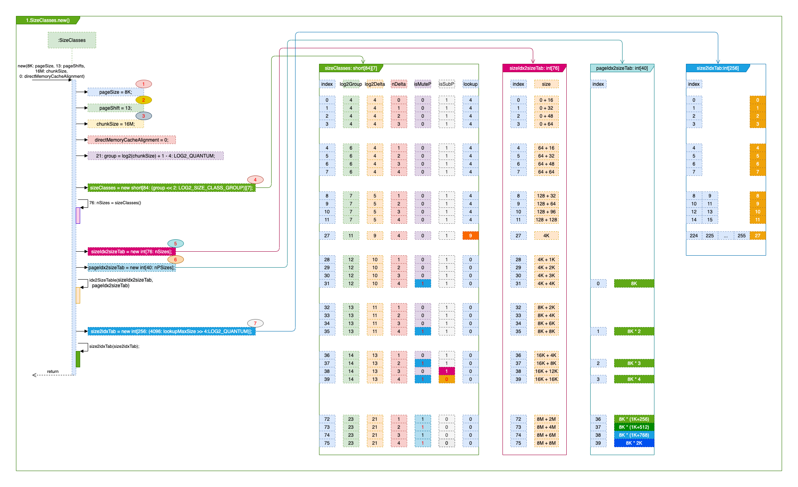

# SizeClasses 
### 一. 干什么?

1. 设定尺寸: 这一个楼层咱们建多大面积, 每个房间多大.

2. 对需求进行分档: 便于管理, 对需求进行标准化. 就像考试的分数会成A/B/C/D/E 多个档位一样, 例如85分以上都划为A档. 

### 二. 打算怎么干? 
​	附一张SizeClasses初始化时的过程与数据结构图, 按图说.      
1. 设定面积: 通过传入的参数设置.
    - :one: **pageSize**: 房间面积, 框架默认8K, 可以通过启动参数调整.
    - :three: **chunkSize**: 一个楼层的尺寸, 系统默认16M, 可以通过启动参数调整.
    
2. 分档: 

    - 一级分档: 

      > - 需要的面积 <= 16K + 12K (28K)时, 跟其它人一起共享, 在PoolSubpage里.  
      > - \> 28K时, 大客户, 给独立的连续房间, 在Run里. 

      ```mermaid
      graph TD
      A[客户来啦!] 
          A --> C{您需要多大空间?}
          C -->|<= 28K| D[共享区域]
          C -->|> 28K| E[独享空间]
      style A fill:pink,stroke:#333,stroke-width:1px    
      style C fill:#bbf,stroke:#f66,stroke-width:1px,color:#fff,stroke-dasharray: 4 8
      style D fill:orange,stroke:#333,stroke-width:1px  
      style E fill:,stroke:#333,stroke-width:1px 
      ```

    - 二级分档:
    
      > -  面积分档: 除了最小的面积16/32/48/64为成倍数增长, 超过64后, 按**1/4(25%)**的增长. 例如: **64/80/96/112**, **1K/(1K+256)/(1K+512)/(1K+768)**, **1M/(1M+256K)/(1M+512K)/(1M+768K)**  .
      >
      > - 根据需要的面积进行划档, 只多不少. 例如需要(**4K + 30**), 会划分到(**4K+1K**)这一档, 这生意做的, 童叟无欺. :smile: 


### 三. 具体实现:

- 码表:

  > - :four: **<u>sizeClasses</u>** : short[84], 但是index只到75有意义, 如果index > 75 Netty会直接分配Huge的区域, 这在PoolArena中再说明.
  >
  >   为在初始化时创建一个对应码表,其大小根据**chunkSize**来确定,  按二级分档中的规则, 将各级分档的面积阀值放在数组里, 后续根据用户的租赁需求快速定位到需要那样的面积分档. 注意这里的index值, 在后续的逻辑判断中以index值来对应到那一档的面积.
  >
  >   >1. **isMultiPageSize**: 是否为pageSize的整数倍. 
  >   >2. **isSubpage**: 是否为共享空间.
  >
  > - :five: **<u>sizeIdx2sizeTab</u>** : int[76]
  >
  >   根据sizeClasses中的有效分档, 计算每个分档的面积大小. 这样通过chunkSize 的index可以获取档位的面积大小.
  >
  > - :six: **<u>pageIdx2sizeTab</u>**: int[40]
  >
  >   根据sizeClasses中 isMultiPageSize == 1的档位来生成, 也就是只包含是page整数倍的档位及对应的面积.
  >
  > - :seven: **<u>size2idxTab</u>**: int[256]
  >
  >   大小由sizeClasses中最大的log2DeltaLookup来, 默认sizeClasses[27]对应的4K, 存放的每sizeClasses.index对应第多少个16, 在应用时, 就可以 size2idxTab[面积/16] 为sizeClasses.index. 
  >
  >   

- 方法: 

  > - ```java
  >   public int size2SizeIdx(int size) 
  >   ```
  >
  >   size为需要的面积大小, 通过sizeClasses 码表, 找到对应的分档id. 
  >
  >   例如 
  >
  >   |     size     | sizeClasses.index | sizeIdx2sizeTab 面积大小 |
  >   | :----------: | :---------------: | :----------------------: |
  >   |      18      |         1         |            32            |
  >   |      24      |         1         |            32            |
  >   |      40      |         2         |            48            |
  >   | 1024 * 4 + 1 |        28         |     1024 * 4 + 1024      |
  >
  > - ```java
  >   public int pages2pageIdx(int pages)
  >   ```
  >
  >   pages为需要的房间个数:
  >   $$
  >   需要多少个房间(pages) = \frac{需要的面积(size)}{每个房间的面积(pageSize)}
  >   $$
  >   通过pages * pageSize 可以从码表: sizeIdx2sizeTab 找到对应的分档的id, **<u>给多不给少</u>**, 例如:
  >   
  >   |  pages   |  sizeIdx2sizeTab.index  | sizeIdx2sizeTab 面积大小 |
  >   | :------: | :---------------------: | :----------------------: |
  >   |    1     |     0 -- [1 pages]      |           1024           |
  >   |    9     |     8 -- [10 pages]     |        1024 * 10         |
  >   | 1K + 255 | 36 -- [(1K + 256)pages] |    1024 * ( 1K + 256)    |
  >   
  > - ```java
  >  public int pages2pageIdxFloor(int pages)
  >   ```
  > 
  >   类似pages2pageIdx, 只是: **<u>给少不给多</u>**.
  >
  >   例如:
  >   
  >   |  pages   | sizeIdx2sizeTab.index | sizeIdx2sizeTab 面积大小 |
  >   | :------: | :-------------------: | :----------------------: |
  >   |    1     |    0 -- [1 pages]     |           1024           |
  >   |    9     |    7 -- [8 pages]     |         1024 * 8         |
  >   | 1K + 255 |   35 -- [1K pages]    |        1024 * 1K         |
  > 
  > 


### 四. 总结


