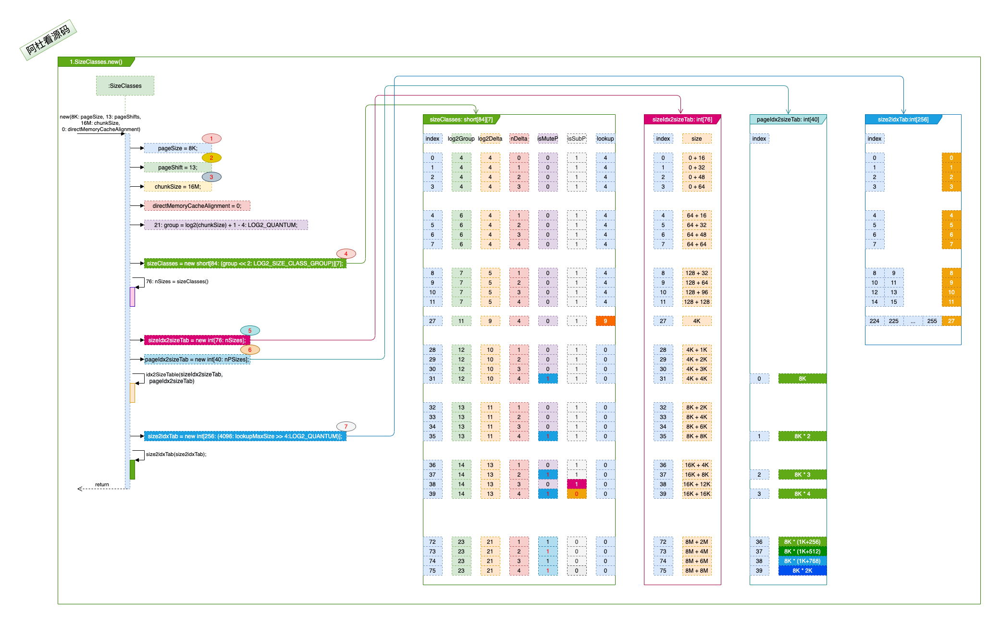

# SizeClasses 
### 一. 干什么?

1. 大方向上, 划定尺寸规格: 
   - 一个楼层咱们建多大面积.
   - 一个房间多大面积.
   - 什么样的面积需求由在共享区域, 另外的在独立房间里.
2. 小细节上, 对需求进行分档: 
   - 便于管理, 对需求进行标准化. 就像考试的分数会成A/B/C/D/E 多个档位一样, 例如85分以上都划为A档. 

### 二. 打算怎么干? 

1. 楼层及每个房间的面积通过参数设定, 为2的N次方. 制定阀值来划分独立房间还是共享区域.
2. 制定一个码表进行分档, 对应码表找到所在档.

### 三. 具体实现:

​	附一张SizeClasses初始化时的过程与数据结构图, 按图说.      
1. 设定面积: 通过传入的参数设置.
    - 图中标号: ​**1** <u>pageSize</u>: 单个房间的面积, 框架默认8K, 可以通过启动参数调整.
    - 图中标号: **3** <u>chunkSize</u>: 一个楼层的尺寸, 系统默认16M, 可以通过启动参数调整.
    
2. 分档: 

    > 1. 一级分档: 
    >
    >   设定阀值, 来决定在共享区域还是独立区域.
    
    > 2. 二级分档:
    > - 面积分档: 4档一组, 除了最小的面积16/32/48/64为成倍数增长, 超过64后, 按**1/4(25%)**的增长. 
    >
    >   | 分档 | 分组 |      面积大小      |
    >   | :--: | :--: | :----------------: |
    >   |  0   |  4   |         16         |
    >   |  1   |  4   |         32         |
    >   |  2   |  4   |         48         |
    >   |  3   |  4   |         64         |
    >   |      |      |                    |
    >   |  27  |  9   |         4K         |
    >   |      |      |                    |
    >   |  28  |  10  | 4K + 1K (**25%**)  |
    >   |  29  |  10  | 4K + 2K (**50%**)  |
    >   |  30  |  10  | 4K + 3K (**75%**)  |
    >   |  31  |  10  |   8K (**100%**)    |
    >   |      |      |                    |
    >   |  32  |  11  | 8K + 2K (**25%**)  |
    >   |  33  |  11  | 8K + 4K (**50%**)  |
    >   |  34  |  11  | 8K + 6K (**75%**)  |
    >   |  35  |  11  | 8K + 8K (**100%**) |
    >   |      |      |                    |
    >   |  72  |  23  |      8M + 2M       |
    >   |  73  |  23  |      8M + 4M       |
    >   |  74  |  23  |      8M + 6M       |
    >   |  75  |  23  |      8M + 8M       |
    >
    > - 根据需要的面积进行划档, 只多不少. 例如需要(**4K + 30**), 会划分到(**4K+1K**)这一档, 这生意做的, 童叟无欺. :smile: 

3. 码表:

    > - 图中标号: ​**4** **<u>sizeClasses</u>** 是一个<u>short[84]</u>, 但是index只到<u>75</u>有意义, 如果 <u>index > 75</u> Netty会直接分配Huge的区域, 这在*PoolArena*中再说明.
    >
    >   ​	*PoolArena*( extends *SizeClasses*)在初始化时创建一个对应码表, 其大小根据<u>chunkSize</u>来确定,  按二级分档中的规则, 将各级分档的面积阀值放在数组里, 后续根据用户的面积需求快速定位到对应到那一级分档. 注意这里的<u>index</u>值, 在后续的逻辑判断中以index值来对应到那一档的面积.
    >
    >   >1. <u>isMultiPageSize</u>: 是否为pageSize的整数倍. 
    >   >2. <u>isSubpage</u>: 是否为共享空间.
    >
    > - 图中标号: **5** <u>sizeIdx2sizeTab</u> : int[76]
    >
    >   ​	根据sizeClasses中的有效分档, 计算每个分档的面积大小, 与sizeClasses数组的下标是一一对应的, 这样通过<u>sizeClasses</u>的index可以获取档位的面积大小.
    >
    > - 图中标号: **6** <u>pageIdx2sizeTab</u>: int[40]
    >
    >   ​	根据sizeClasses中 isMultiPageSize == 1的档位来生成, 也就是只包含是page整数倍的档位及对应的面积.
    >
    > - 图中标号: **7** <u>size2idxTab</u>: int[256]
    >
    >   ​	大小由sizeClasses中最大的log2DeltaLookup来, 默认sizeClasses[27]对应的4K, 存放的每sizeClasses.index对应多少个16, 在应用时, 就可以 size2idxTab[] 为sizeClasses.index. 
    >   
    >   ```java
    >   int size2idxTabIdx = reqCapacity/16;// 先通过需要的面积除以16就可以获得到size2idxTab 数组对应的id.
    >   int sizeClassesIdx = size2idxTab[size2idxTabIdx]; // 通过size2idxTabIdx 可以找到对应的sizeClasses 的idx.
    >   ```

4. 方法: 

    > 
    > - ```java
    >     public int size2SizeIdx(int size) 
    >   ```
    >
    >   ​	size为需要的面积大小, 通过sizeClasses 码表, 找到对应的分档id. 例如: 
    >
    >   |     size     | sizeClasses.index | sizeIdx2sizeTab 面积大小 |
    >   | :----------: | :---------------: | :----------------------: |
    >   |      18      |         1         |            32            |
    >   |      24      |         1         |            32            |
    >   |      40      |         2         |            48            |
    >   | 1024 * 4 + 1 |        28         |     1024 * 4 + 1024      |
    >   
    > - ```java
    >  public int pages2pageIdx(int pages)
    >   ```
    >   ​	pages为需要的房间个数:
    > $$
    > 需要多少个房间(pages) = \frac{需要的面积(size)}{每个房间的面积(pageSize)}
    > $$
    >   ​	通过pages * pageSize 可以从码表: sizeIdx2sizeTab 找到对应的分档的id, **<u>给多不给少</u>**, 例如:
    > 
    > |  pages   |  sizeIdx2sizeTab.index  | sizeIdx2sizeTab 面积大小 |
    > | :------: | :---------------------: | :----------------------: |
    > |    1     |     0 -- [1 pages]      |           1024           |
    > |    9     |     8 -- [10 pages]     |        1024 * 10         |
    > | 1K + 255 | 36 -- [(1K + 256)pages] |    1024 * ( 1K + 256)    |
    > 
    > - ```java
    >    public int pages2pageIdxFloor(int pages)
    >   ```
    > 
    >   类似pages2pageIdx, 只是: **<u>给少不给多</u>**.
    > 
    >   例如:
    >
    >   |  pages   | sizeIdx2sizeTab.index | sizeIdx2sizeTab 面积大小 |
    >   | :------: | :-------------------: | :----------------------: |
    >   |    1     |    0 -- [1 pages]     |           1024           |
    >   |    9     |    7 -- [8 pages]     |         1024 * 8         |
    >   | 1K + 255 |   35 -- [1K pages]    |        1024 * 1K         |


### 四. 总结


