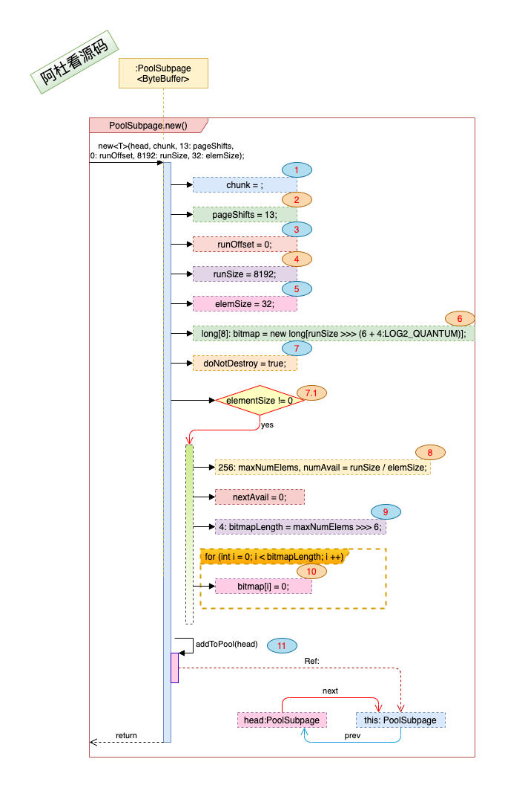
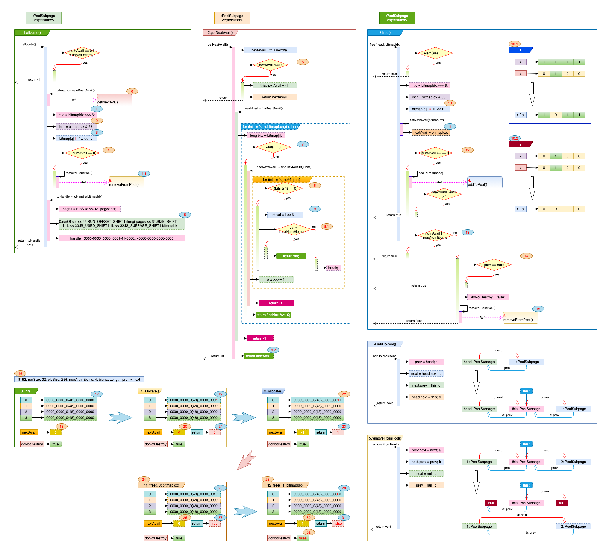

## Netty_PooledByteBuf_2.PoolSubpage

### 一. 干什么?

​	概括起来如下: 

1. 当用户需要一个比较小的面积来办公时, 可以将用户安置在由一个或者多个房间的共享区域内. ---- 就像在会议室里找到一个位子.
2. 可以满足用户不同的面积需求, 例如 有要32平的, 有要64平的, 也有要1024平的. ---- 高铁也分二等座, 一等座, 商务舱不是.
3. 共享区域可以进行面积的分配和回收. ---- "对不起, 这个位子有人", "看, 那个位子没人". 


### 二. 打算怎么干? 

1. 当用户需要的面积规格 <= <u>smallMaxSizeIdx</u>时, Netty将一个或者多个Page 组成一个共享区域(*PoolSubpage*), 用户的需求由这个共享区域来满足.

   注: <u>smallMaxSizeIdx</u> 在*SizeClasses*中默认为38, 38对应*SizeClasses*类的<u>sizeClasses</u>的数组下标, 对应的面积大小为**28K**.

2. 用户需求的面积规格不同(16平, 48平, 1024平), 对应的共享区域的规格也会不同. 如果用户需要的面积是<u>elemSize</u>, 每个房间的面积是<u>pageSize</u>, 那么对应的共享区域的面积是: 最小公倍数(<u>elemSize</u>, <u>pageSize</u>), 这样保证共享区域可以被<u>elemSize</u>整除, 空间不浪费.

3. 面积管理, 分配与回收:

   - 共享区域内的面积管理, 就像一个会议室里的座椅一样, 保持阵型, 要确定一个坐椅的位置, 知道第几排第几列就行. *PoolSubpage* 中由long[] <u>bitmap</u>来充当阵型管理.
   - 分配: 找到一个空位置, 然后标记这个空位置已占用(1-为已占用). 如果没有空位置了, 说明这个共享区域满了, 再试试其它的共享区域.
   - 回收: 根据位置的坐标定位到该位置, 标记这个位置为空置(0-空置). 如果所有的位置都是空置状态了, 那这个共享区域可以被回收了.

   

### 三. 具体实现:

1. #### 先来看下数据结构:

   > *PoolSubpage*初始化时:
   > 
   >
   > 各项注解:
   >
   > 1. 图中标号: **1** <u>chunk</u>: 共享区域属于那一个楼层(*PoolChunk*). 
   >
   > 2. 图中标号: **3** <u>runOffset</u>: 共享区域(*PoolSubpage*)是从第几个房间(page)开始的. 示例中为0, 表明是从第0个房间开始.
   >
   > 3. 图中标号: **4** <u>runSize</u>: 共享区域(*PoolSubpage*)的面积有多少, 一个共享区域可以由一个或者多个房间组成. 示例中为**8192**, 表示占用一个房间(默认一个房间的大小为**8K**). 
   >
   > 4. 图中标号: **5** <u>elemSize</u>: 每个位置的面积是多少. 示例中为32, 表示这个共享区域下, 一个位置有32平这么大, 这将是一个比较拥挤的会议室. 
   >
   > 5. 图中标号:  **6** <u>bitmap</u>: 源码中根据<u>runSize</u> 除以最小的<u>elemSize</u>(16)计算出需要多少位置(<u>maxNumElems</u>), 再将位置分在64一组的long数组里. 注: <u>这里的按最小的16(elemSize)进行计算位置大小, 会有很大的空间浪费, 不明白其中的用意?</u>. 
   >    $$
   >    bitmap:long[](记录是否占用的数组) = \frac{(\frac{runSize(需要的面积)}{elemSize(每个位置的面积)})}{64(每一个long可以记录64个位置)}
   >    $$
   >
   > 6. 图中标号: **7.1** elemSize: <u>还有为0的时候?</u>
   >
   > 7. 图中标号:  **8** 根据runSize与elemSize计算<u>maxNumElems</u>(最多需要多少位置).
   >
   > $$
   > maxNumElems (最多需要多少位置) = \frac{runSize(需要的总面积)}{elemSize(每个位置的面积)}
   > $$
   >
   > 8. 图中标号:  **9** <u>bitmapLength</u>: 因为一个long可以标记64个位置的信息, 有些大的面积需求总共(<u>maxNumElems</u>)下来也不到64(例如超豪华的会议室, 就放两个座位), 所以需要计算出bitmapLength进行判断限制.
   >
   > $$
   > bitmapLength (一共有多少个位置可以进行标记) = \frac{maxNumElems(最多需要多少位置)}{64(一个long可以标记64个位置的信息)}
   > $$
   >
   > > long中的每一个bit位标记位置是否分配.
   > >
   > > - 0 -- 使用中.
   > > - **1** -- **空置中**.
   > >
   > > 0000-0{56}-1010 : 表示:
   > >
   > > - 第一个位置: 无人
   > > - 第二个位置: **有人**
   > > - 第三个位置: 无人
   > > - 第四个位置: **有人**
   >
   > 9. 图中标号: **10** 对<u>bitmap</u>中的每一个long赋值, 为0. 会议室里所有的位置都是空着的.
   > 10. 图中标号: **11** 对*PoolSubpage*对象进行管理, 加入到*PoolArena*的管理队列中, 后续再细说. 

2. #### 方法实现

   > 概括起来, 实现的方法分为两块, 一块是分配, 一块是回收. 
   >
   > 
   >
   > 1. ##### 分配:
   >
   >    > 由<u>allocate()</u>方法实现. 实现的过程就是从<u>bitmap</u>数组中, 从最初的位置(第一排第一个位置)开始找, 找到第一个还没有被人占用的位置, 然后标记此位置被征用了, 如果没有空间了, 会有一些维护操作. 最后这个返回位置的**坐标信息**. 
   >    >
   >    > 主要对应图中的  <u>1.allocate()</u>与 <u>2.getNextAvail()</u> 两个方法. 入口为<u>allocate()</u>方法, 
   >    >
   >    > 1. allocate()方法:
   >    >
   >    >    > 1. 图中标号: **0** 通过<u>getNextAvail()</u>获取可用的位置, 下面细说.
   >    >    >
   >    >    > 2. 图中标号: **1**
   >    >    >
   >    >    >    ```java
   >    >    >    int q = bitmapIdx >>> 6; // 获取到bitmap[]数组的下标, 可以认为是会议室的第几排, 可以看 图中标号:9 , bitmapIdx的生成.
   >    >    >    ```
   >    >    >
   >    >    > 3. 图中标号: **2**
   >    >    >
   >    >    >    ```java
   >    >    >    int r = bitmapIdx & 63; // 在long 的64位中, 是属于第几个bit位, 可以看 图中标号:9 , bitmapIdx的生成.
   >    >    >    // 这里数字63的二进制表示为: 0000-0{52}-0011-1111 
   >    >    >    // bitmapIdx & 63 就只是取bitmapIdx 后6位的数据, 转换成一个整数, 表示在会议室第N排中的第几个位置.
   >    >    >    ```
   >    >    >
   >    >    > 4. 图中标号: **3**
   >    >    >
   >    >    >    ```java
   >    >    >    bitmap[q] |= 1L << r ;  // 将bitmap中对应的标记位设置为1, 表示这个位置现在被征用了.
   >    >    >    ```
   >    >    >
   >    >    > 5. 图中标号: **4**
   >    >    >
   >    >    >    ```java
   >    >    >    if( -- numAvail == 0) // 根据运算符的优先级, 这里先对 numAvail 进行 -- 操作, 再对 (-- numAvail) == 0 进行判断
   >    >    >    ```
   >    >    >
   >    >    > 6. 图中标号: **4.1**, 如果 <u>numAvail == 0</u>, 说明这个共享区域中已经没有可用的位置进行分配了, 所有的位置都有人坐了, 需要对它进行管理操作, 从管理链表中移除, 我们在*PoolArena*中再细说.
   >    >    >
   >    >    > 7. 图中标号:  **5** *PoolChunk* 中规定由一个long中的bit位来表示从那个房间开始到那个房间结束的共享区域内, 第几排, 第几位的信息的, 详细的在PoolChunk中再细说.
   >    >    >
   >    >    >    ```java
   >    >    >    return 0:runOffset << 49:RUN_OFFSET_SHIFT | (long) pages << 34:SIZE_SHIFT 
   >    >    >        | 1L << 33:IS_USED_SHIFT | 1L << 32:IS_SUBPAGE_SHIFT | bitmapIdx;
   >    >    >    ```
   >    >    >
   >    >    > 
   >    >
   >    > 2. 图中标号: **0** <u>getNextAvail()</u> 方法是从<u>bitmap: long[]</u>中返回第一个空位置的坐标信息.
   >    >
   >    >    > 1. 图中标号: **6** <u>nextAvail</u> 为一个缓存值, 就像刚刚有一个人离场, 那他之前的位置是空的, 当*PoolSubpage*刚刚初始化完成(值为0), 或者free()方法调用后, 有位置归还时, nexAvail >= 0. 
   >    >    >
   >    >    > 2. 图中标号: **7** <u>~bits != 0</u> 这是判断bits中是否还空位置. 
   >    >    >
   >    >    >    如果所有的bit位都是1, 那么 ~(非运算) 的值为0, 如果~bits == 0 说明所有的bit位都是1, 没有空位置了.
   >    >    >
   >    >    >    这里要注意的是, 如果long 的64个bit位不一定全都要用, 例如诺大的会议室只摆两个座位(能在这开会的级别那真是刚刚的), 那只用long最后的两位作标记位. 那么即使没有空位置了, 那~bits 也不为0, 所以下面对每一个bit位进行是否空置的判断时, 要增加 图中标号: **9.1** <u>val < maxNumElements</u> 的判断.  
   >    >    >
   >    >    > ```java
   >    >    > ~1111; // = 0000
   >    >    > ~0000; // = 1111
   >    >    > ~0011; // = 1100 这里只是最后两位用来标记.
   >    >    > ```
   >    >    >
   >    >    > 3. 图中标号: **8** 通过 <u>(bits & 1) == 0</u> 来判断bits的 0 bit位(最后一位) 是不是0, 如果是0表示这个位置是空置的.  bits 通过for循环底部的 bits >>>= 1; 进行向右移位操作, 就是一个座位一个座位的看, 是不是有人座着:
   >    >    >
   >    >    > ```java
   >    >    > 0000-1111 >>> 1;  // = 0000-0111
   >    >    > 0000-0111 >>> 1;  // = 0000-0011
   >    >    > 
   >    >    > 0000-0111 & 1 ; // = 0000-0001
   >    >    > 0000-0110 & 1 ; // = 0000-0000
   >    >    > ```
   >    >    >
   >    >    > 4. 图中标号: **9** int val = i << 6 | j; 
   >    >    >
   >    >    >   ```java
   >    >    > int val = i << 6 | j; // 其中 i 为bitmap[]数据的下标, 表示第几个long, 会议室中的第几排. j 为在long中的第几位, 位置是第几个. 
   >    >    > val = 1 << 6 | 4; // = 0100-0100 // 1 为bitmap[]中的第二个long, 4 表示在long中的第4个bit位. 
   >    >    >   ```
   >    >
   >    > 
   >
   > 2. ##### 回收:
   >
   >    > 通过传入参数<u>bitmapIdx</u>(座的位置信息), 由<u>free()</u>方法来更新对应位置的标记为闲置状态. 更新完成后, 如果<u>bitmap</u>数组中的所有标记位都是闲置状态, 这个会议室是空的, 那么该共享区域可以整体被回收. 
   >    >
   >    > 1. 图中标号: **10** 通过异或运算, 设置bitmap[q]: long 中的第r个位置(0为初始位置)为0:
   >    >
   >    >    ```java
   >    >    bitmap[q] ^= 1L << r ;
   >    >    // q, r 从bitmapIdx中获取, 就像会议室中的第几排, 第几个座位. 参考 图中标号: 9 bitmapIdx的生成.
   >    >    // ^ 为异或运算, 异或运算可以参看下图. 与图中标号: 10.1, 10.2
   >    >    // 例如: q = 1, r = 4;
   >    >    1L << 4 ; // = 0001-0000
   >    >    bitmap[1]; // 原值为 0001-1000
   >    >    bitmap[1] ^= 1L << 4 ; // bitmap[1] = 0000-1000 
   >    >    ```
   >    >
   >    >    
   >    >
   >    > 2. 图中标号: **11**, 设置nextVal 一个类似缓存的值.
   >    >
   >    > 3. 图中标号: **12**, numAvail ++ == 0, 这里是<u>先进行 numAvail == 0的判断</u>, 然后<u>再对numAvail ++</u>. 如果numAvail 初始值为0, 表示没有座位是空的, 现在进行free操作,  那可分配的座位数就大于0了, 则这个*PoolSubpage*共享区域是可以满足下一个分配需求的(之前会议室里满员了, 现在一个人有事要回家, 那肯定就有空位置了), 需要把这个*PoolSubpage*放在管理队列里, <u>addToPool()</u>就是完成这个操作, 后续我们再细说. 
   >    >
   >    > 4. 图中标号: **13**.
   >    >
   >    >    ```java
   >    >    if(numAvail != maxNumElems) // 空置的座位数 != 会议的可容纳的人数, 说明free()操作后还有位置是被占用的. 
   >    >    if(numAvail == maxNumElems) // 说明free()操作后, 所有的位置都释放了, 那整个PoolSubpage也可以被回收.  
   >    >    ```
   >    >
   >    > 5. 图中标号: **14**. 类似于管理缓存的操作, 后面细说.
   >    >
   >    > 6. 图中标号: **15**. 对PoolSubpage整个共享空间进行回收. 后续细说. 
   >
   > 3. ##### 分配与回收示例:
   >
   >    > 1. 图中标号: **16**. PoolSubpage的参数为: 8192: runSize, 32: eleSize, 256: maxNumElems, 4: bitmapLength, pre ! = next.
   >    > 2. <u>0.init()</u>: 初始化时的数据结构.
   >    >    - 图中标号: **17** <u>bitmap</u> 数组所有bit位都是0. 新开的会议室肯定是没人的. 
   >    >    - 图中标号: **18** nextAvail 这时候等于0, 第一个位置是空的.
   >    > 3. <u>1.allocate()</u>: 第一次分配后的数据变化. 
   >    >    - 图中标号: **19** 第一次allocate(), [0]下标的long 的第0 bit位更新成1, 表明这个位置有人坐了. 
   >    >    - 图中标号: **20** nextAvail = -1, 缓存的有用位置变更为无效. 
   >    >    - 图中标号: **21** 返回的bitmapIdx为0. 0排, 0位.
   >    > 4. <u>2.allocate()</u>: 第二次分配后的数据变化.
   >    >    - 图中标号: **22** 第一次allocate(), [0]下标的long 的第1 bit位更新成1.
   >    >    - 图中标号: **23** 返回的bitmapIdx为1. 0排, 1位.
   >    > 5. <u>11.free(, 0: bitmapIdx)</u>: free 0:bitmapIdx后的数据变化.
   >    >    - 图中标号: **25** 根据bitmapIdx(0) 设置第0排, 第0位为空置.
   >    >    - 图中标号: **26** nextAvail = 0, 缓存变更.
   >    >    - 图中标号: **27** 这里返回true. 
   >    > 6. <u>12.free(, 1: bitmapIdx)</u>: free 1:bitmapIdx后的数据变化.
   >    >    - 图中标号: **29** 根据bitmapIdx(1) 设置第0排, 第1位为空置.
   >    >    - 图中标号: **30** nextAvail = 1, 缓存变更.
   >    >    - 图中标号: **31** 这里返回false, 这里的false表示位置回收, 共享区域也要回收.
   >    >    - 图中标号: **32** doNotDestroy = false, 共享区域也回收了.
   
   

### 四. 总结:

​	

#### 		"阿杜看源码"所有稿件, 未经正式授权一律不得转载、出版、改编，或进行与"阿杜看源码"版权相关的其他行为，违者必究！


