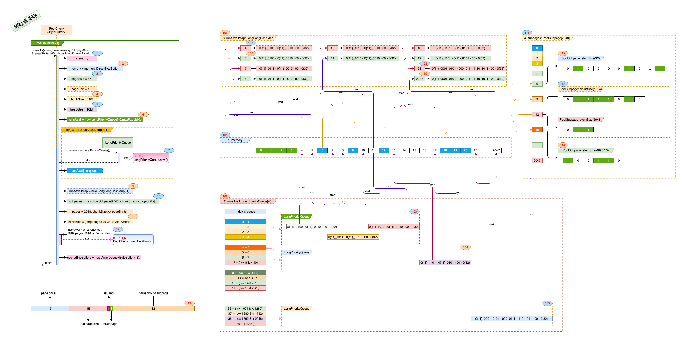

## Netty_PooledByteBuf_3.PoolChunk

### 一. 干什么?

​	PoolChunk 是来管理一个楼层中的房间的, 就像个楼主. 概括起来如下: 

1. 根据面积需求, 是给分配独立的区域还是共享区域.

2. 不管是独立还是共享区域下面积的分配与回收.

3. 管理的面积这么大, 怎么样可以让分配与回收的效率更高. 

   

### 二. 打算怎么干? 

1. 根据设定的阀值, 来区分是分配独立区域还是共享区域.

2. 对外提供统一接口进行面积的分配与回收.

3. 独立区域和共享区域都有唯一的门牌号并记录在案, 直接在账本上进行登入登出.

   

### 三. 具体实现:

1. 是分配独立区域还是共享区域?
    > - 需要的面积 <= 16K + 12K (28K)时, 跟其它人一起共享, 在*PoolSubpage*里. 
    > - \> 28K时, 大客户, 给独立的连续房间, 在*Run*里. 
    > ```mermaid
    > graph TD
    > A[客户来啦!] 
    >     A --> C{您需要多大空间?}
    >     C -->|<= 28K| D[共享区域]
    >     C -->|> 28K| E[独享空间]
    > style A fill:pink,stroke:#333,stroke-width:1px    
    > style C fill:#bbf,stroke:#f66,stroke-width:1px,color:#fff,stroke-dasharray: 4 8
    > style D fill:orange,stroke:#333,stroke-width:1px  
    > style E fill:,stroke:#333,stroke-width:1px 
    > ```

2. 分配与回收之前, 先来看一下PoolChunk初始化的数据结构.

    > 
    >
    > 各项注解:
    >
    > 1. 图中标号: **1** , <u>arena</u>该楼层在那一幢建筑内.
    > 2. 图中标号: **2**, memory 对应的内存对象.
    > 3. 图中标号: **3**, pageSize 一个房间有多大, 这里是8K.
    > 4. 图中标号: **4** , chunkSize PoolChunk 对应的楼层有多大面积.
    > 5. 图中标号: **5**, freeBytes 还有多少面积是可以分配的.
    > 6. 图中标号: **6**, runsAvail 对应的 LongPriorityQueue[40:maxPageIdx] 数组, 对应的数组大小为SizeClasses中的pageIdx2sizeTab 数据的大小, 为独立空间下对应的所有分档, 

