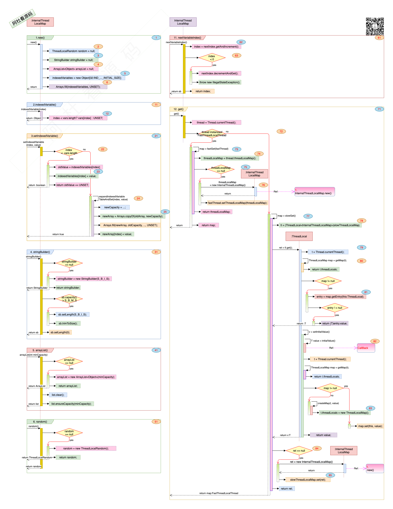

## Netty_Cache_11.InternalThreadLocalMap

### 一. 干什么?

1. 官方说法: 线程的的私有变量. 
2. 租房说法: 每个中介员的抽屉.

### 二. 打算怎么干? 

1. 每个Thread关联一个InternalThreadLocalMap对象. 为什么有了Thread.threadLocals还要创建一个InternalThreadLocalMap呢, 因为threadLocals是一个Map, InternalThreadLocalMap中有indexedVariables 这样的Object[], 通过下标的方式访问, 速度更快.

   

### 三. 具体的实现:

1. 数据结构与接口:

   > 
   >
   > 1. 图中标号: **1**. 1.new()初始化方法.
   >    - 图中标号: **2**. 线程下可复用的random变量. 
   >    - 图中标号: **3**. 线程下可复用的stringBuilder变量. 
   >    - 图中标号: **4**. 线程下可复用的arrayList变量. 
   >    - 图中标号: **5, 6**. 线程下indexedVariables数组, 初始大小默认32, 默认value为UNSET, 自动扩容.
   > 2. 图中标号: **11, 12**. 2.indexedVariable(), 根据下标从 indexedVariables中获取value, 如果超出界限返回UNSET.
   > 3. 图中标号: **21**. 3.setIndexedVariable(), 设置下标的value值.
   >    - 图中标号: **22, 23**. 先判断是否越界, 如果不越界设置相应的下标值.
   >    - 图中标号: **24, 25**. 如果越界, indexedVariables进行扩容, 再设定值.
   > 4. 图中标号: **31, 41, 51**. 4. stringBuilder, random, arrayList的获取.
   > 5. 图中标号: **61, 62, 63**. 11. nextVariableIndex() 是一个static方法, 根据nextIndex.getAndIncrement();获取一个自增的唯一id, FastThreadLocal用这个值来对应indexedVariables 数组的下标, 但是这个值是static的变量, 会有问题.
   > 6. 图中标号: **71**. 12. get(), 获取与线程关联的InternalThreadLocalMap对象, 如果当前的线程是FastThreadLocal, 那从fastTL中取map, 如果不是从ThreadLocal对象中取map.
   >    - 图中标号: **72**. 判断当前线程是不是FastThreadLocal类型.
   >    - 图中标号: **73, 74, 75, 76**. 如果是FastThreadLocal类型, 是可能通过threadLocalMap()获取到map的, 如果为空就初始化.
   >    - 图中标号: **77, 78**. 从ThreadLocal对象中来获取InternalThreadLocalMap.
   >    - 图中标号: **79, 80, 81, 82, 83, 84, 85**. 是展示的ThreadLocal怎么利用Thread的threadLocals来获取到InternalThreadLocalMap的过程.
   >    - 

1. [InternalThreadLocalMap](./11.InternalThreadLocalMap.html) 就是
2. [FastThreadLocal](./12.FastThreadLocal.html) 就是第几个抽屉编号.
3. [Recycler](./13.Recycler.html) 