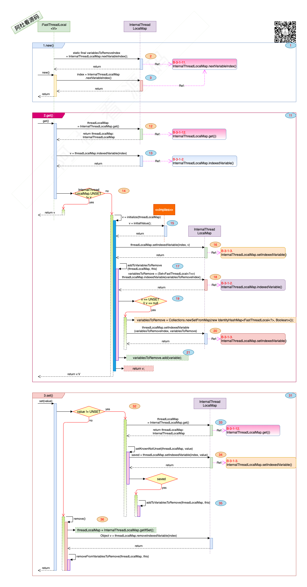

## Netty_Cache_12.FastThreadLocal

### 一. 干什么?

1. 官方说法: 类似于ThreadLocal, 只不过FastThreadLocal通过下标index获取数组中对应的值, ThreadLocal是根据本身做key从map中取值. 
2. 白话说法: 是从桶里一件一件的翻还是直接从一个抽屉里取出来.

### 二. 打算怎么干? 

1. FastThreadLocal创建时, 生成一个唯一id(这个id在线程下唯一就可以), 这个id就是第几个抽屉的编号, 后续根据抽屉编号取物件.

   

### 三. 具体的实现:

1. 数据结构与接口:

   > 
   >
   > 1. 图中标号: **1**. 1.new()初始化方法.
   >    - 图中标号: **2**. variablesToRemoveIndex 是一个抽屉的编号, 放一系列通过FastThreadLocal创建的对象(Set<FastThreadLocal<?>> ), 以便在资源释放时进行资源回收.
   >    - 图中标号: **3**. index表明该FastThreadLocal对应的是个抽屉.
   > 2. 图中标号: **11**. 2.get()初始化方法. 
   >    - 图中标号: **12, 13, 14**. 通过index从threadLocalMap这个抽屉柜上取到相应的抽屉, 把里面的物件拿出来. 如果物件不是UNSET, 就拿走了.
   >    - 图中标号: **15, 16, 17, 18, 19, 20, 21**. 是空的话, 通过回调方法initiallValue()去创建物件, 并放在抽屉里. 还要把这个物件在variablesToRemove要删除的名单上挂个号, 可以被清除, 会调用onRemove()方法.
   > 3. 图中标号: **31**. 3.set()初始化方法. 通过抽屉对应的编号将物价放在抽屉里.

