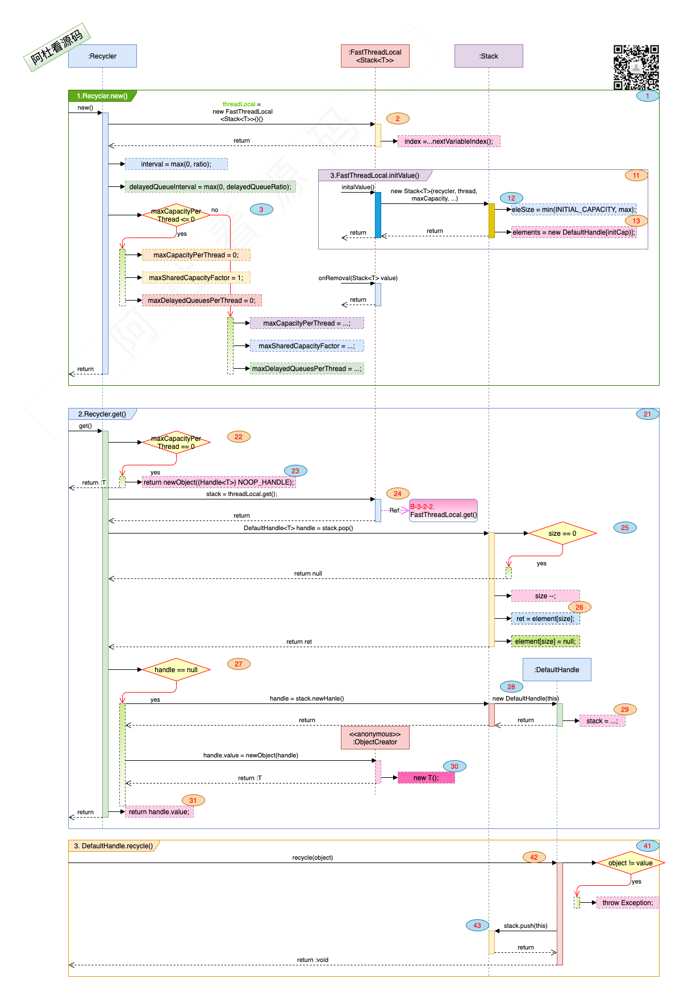

## Netty_Cache_13.Recycler

### 一. 干什么?

1. 官方说法: 用一个栈(Stack)来存储与弹出可回收的资源对象, 来对对象进行重用. 
2. 白话说法: 弹夹里的子弹打完了, 再用弹壳装上弹药再摁回弹夹里, 下次接着打.

### 二. 打算怎么干? 

1. 做个弹夹, 能弹能摁的那种.

   

### 三. 具体的实现:

1. 数据结构与接口:

   > 
   >
   > 1. 图中标号: **1**. 1.Recycler.new()初始化方法. 
   >    - 图中标号: **2**. Recycler创建了一个threadLocal : FastThreadLocal变量, 来定位那个抽屉. 图中标号: **11, 12, 13**. 如果抽屉里没有东西, 要造一个什么东西放进去, 这里是一个Stack弹夹.  
   >    - 图中标号: **3**. 如果设置maxCapacityPerThread <= 0, 就不会创建Stack了, 不做缓存了.
   > 2. 图中标号: **21**. 2.Recycler.get()初始化方法. 弹个子弹出来.
   >    - 图中标号: **22, 23**. 如果弹夹里不让放子弹, 弹个不做任何操作的子弹出来.
   >    - 图中标号: **24, 25, 26**. 弹个子弹出来.
   >    - 图中标号: **27, 28, 29, 30**. 如果没有子弹, 就造一个.   
   >    - 图中标号: **31**. 子弹发射出去, 留下弹壳.
   > 3. 图中标号: **41, 42, 43**. 3. DefaultHandle.recycle() 弹壳重新装火药后, 放弹夹里.
   > 4. 图中标号: **51**. 4.ObjectPool.newPool(), 弹夹不是谁都能碰到的(Recycler 构造方法是protected), 统一的ObjectPool为出入口, 提供newObject()方法就可以了. 
   > 5. 图中标号: **61**. 5.PooledUnsafeDirectByteBuf.RECYCLER 创建PooledUnsafeDirectByteBuf的示例.
   > 6. 图中标号: **71**. 6.MemoryRegionCache.RECYCLER 创建MemoryRegionCache的示例.

