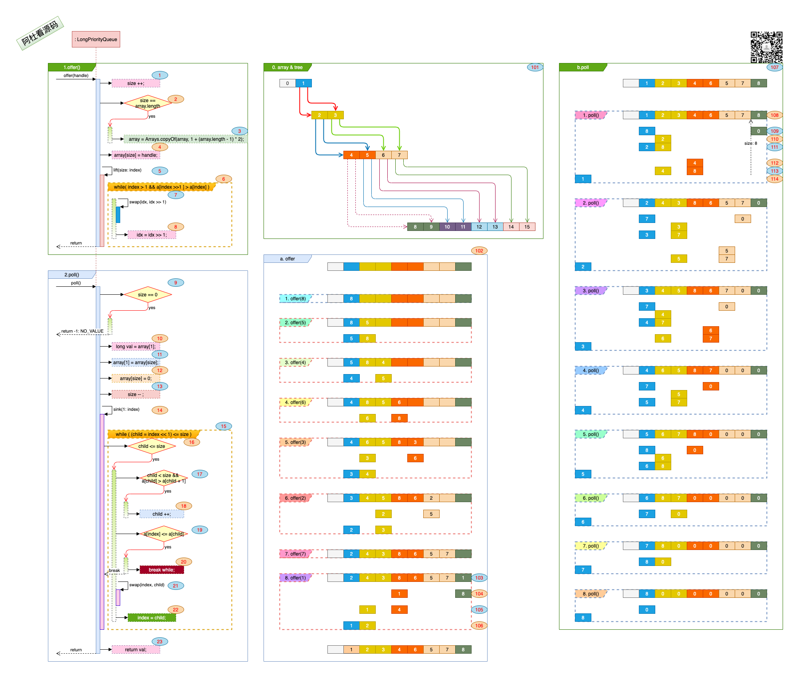

## Netty_PooledByteBuf_3.1.LongPriorityQueue

### 一. 干什么?

​	*LongPriorityQueue* 插入无序的数据, 获取有序的结果. 

### 二. 具体实现:
​	数据结构与方法: 

1. #### 数据结构:

   > - 通过array:(初始long[9])来存储数据, 存储的方式如 图中标号: **101**, 第一级由数组下标0-1, 0位置闲置, 1为parent, 1的子节点有两个, 占用下标2和3, 2的子节点为4-5, 3的子节点为6-7, 7的子节点为14-15, 这样父节点与子节点的关系为:
   >
   >   | 父节点 |  子节点表达式   |
   >   | :----: | :-------------: |
   >   |   n    |   左节点 = 2n   |
   >   |   n    | 右节点 = 2n + 1 |
   >
   > - 数组满的时候, 通过 图中标号: **3** array = Arrays.copyOf(array, 1 + (array.length - 1) * 2); 来进行扩充.
   >
   > - 存入数据时, 保证 <u>父节点 <= 子节点</u>.

2. #### 方法实现:

   > 1. offer(hanle): 向队列里追加数据. 保证 <u>子节点 >= 父节点</u>.
   >
   >    - 图中标号: **1**, size ++, 数据增长.
   >
   >    - 图中标号: **2**, 判断是否增长后, array数组没有空间了.
   >
   >    - 图中标号: **3**, array数组扩容.
   >
   >    - 图中标号: **4**, 将新插入的handle数据放在之前队列的最后.
   >
   >    - 图中标号: **5**, 新插入的数据可能会影响排列的规则, 要进行整理.
   >
   >    - 图中标号: **6**, **7**, **8**, 
   >
   >      ```java
   >      while( index > 1 && a[index >>1 ] > a[index] ) { //  如果父节点 a[index >>1] 大于 子节点 a[index]
   >        swap(idx, idx >> 1); // 进行子节点与父节点交换
   >        idx = idx >> 1; // 检查父节点的上一级
   >      }  
   >      ```
   >
   > 2. poll(): 取最小的那条数据.
   >
   >    - 图中标号: **9**, 如果没数据, 返回NO_VALUE(-1);
   >
   >    - 图中标号: **10**, array[1] 肯定是最小的(由offer()插入时保证), val是要返回的数据.
   >
   >    - 图中标号: **11**, **12**, **13**.
   >
   >      ```java
   >      //将最后一位的值赋给第一位, 并将最后一位的值赋0, 整个数据集缩小1. 
   >      array[1] = array[size]; 
   >      array[size] = 0; 
   >      size -- ;
   >      ```
   >
   >    - 图中标号: **14**, sink()方法的调用, 是因为现在root节点(array[1])由最后一位替换, 有可能不满足 "子节点 >= 父节点" 的规则, 要进行检查及调整.
   >
   >    - 图中标号: **15**
   >
   >      ```java
   >      while ( (child = index << 1) <= size ){ // child(index << 1)表示parent节点的左子节点. 
   >      }  
   >      ```
   >    
   >    - 图中标号: **16**, child <= size, child节点还在有效的集合内.
   >    
   >    - 图中标号: **17, 18**
   >    
   >      ```java
   >      if (child < size && a[child] > a[child + 1]){ // child < size测试右节点是否存在. a[child] > a[child + 1]: 如果左节点大于右节点就选右节点出战, 要选一个最小的子节点跟父节点去对比.
   >        child ++; 
   >      }  
   >      ```
   >    
   >    - 图中标号: **19, 20**, 
   >    
   >      ```java
   >      if (a[index] <= a[child]){ //如果父节点(a[index]) <= 最小的节节点(a[child]), 就可以退出循环了, 因为子节点下的孙节点是满足规则的.
   >        break;
   >      }  
   >      ```
   >    
   >    - 图中标号: **21, 22**
   >    
   >      ```java
   >      swap(index, child); //走到这里, 说明子节点要小于父节点, swap将两个节点的值对调. 
   >      index = child; // 对调后, 将子节点赋值给index, 再下一轮循环时检查子节点的孩子是否遵循"子节点 >= 父节点"的规则.
   >      ```
   
3. #### 用例:
   
   > 1. offer(): 图中标号: **102**.
   >
   >    多次offer()数据后, offer(1)时:
   >
   >    - 图中标号: **103**, 将1放在数据集的最后一位, 对应array[8]. 这里的数组扩容未表示.
   >    - 图中标号: **104**, 左子(array[8])与父(array[8/2])对比, 值1 < 8, 交换位置.
   >    - 图中标号: **105**, 左子(array[4])与父(array[4/2])对比, 值1 < 4, 交换位置.
   >    - 图中标号: **106**, 左子(array[2])与父(array[2/2])对比, 值1 < 2, 交换位置.
   >
   > 2. poll(): 图中标号: **107**.
   >
   >    offer(1)数据后, 第一次poll()数据时:
   >
   >    - 图中标号: **108**, 数据的原始状态.
   >    - 图中标号: **109**, 将有效数据最后一位置于root位(array[1]), 原位置(array[8])置于0, 有效数据集收缩size -- .  
   >    - 图中标号: **110**, array[1 * 2]与array[1 * 2 + 1]对比起来, 左节点:2是最小的.
   >    - 图中标号: **111**, 左节点(array[1 * 2])与父节点(array[1])对换值.
   >    - 图中标号: **112**, array[2 * 2]与array[2 * 2 + 1]对比起来, 左节点:4是最小的.
   >    - 图中标号: **113**, 左节点(array[2 * 2])与父节点(array[2])对换值.
   >    - 图中标号: **114**, 返回的是最初的root节点(array[1]).

### 三. 总结:

​	*LongPriorityQueue*内的数组保证的规则是: <u>父节点 <= 子节点</u>.

   

   

