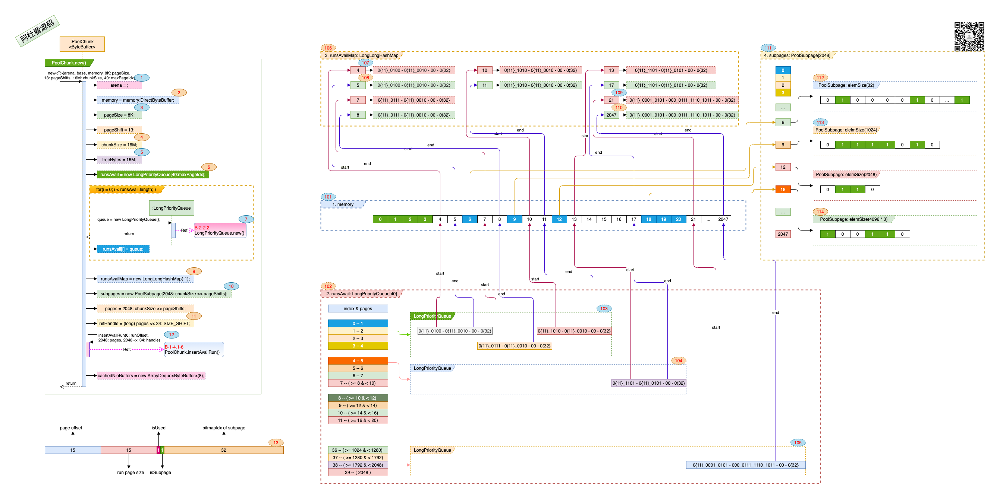
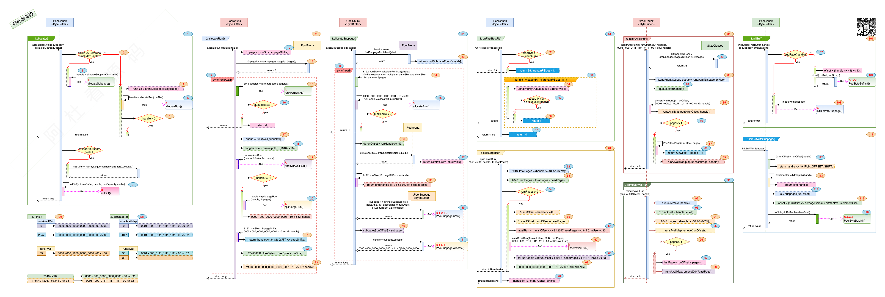
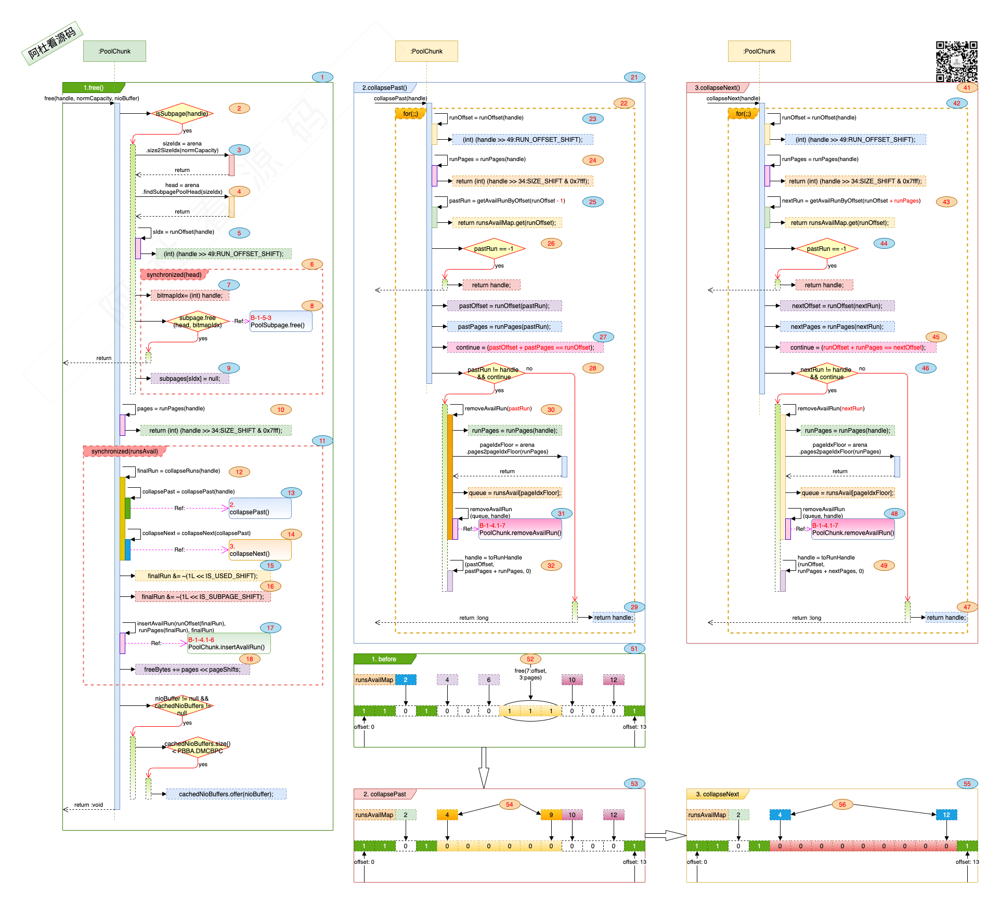

## Netty_PooledByteBuf_3.PoolChunk

### 一. 干什么?

​	PoolChunk 是来管理一个楼层中的房间的, 就像个楼主. 概括起来如下: 

1. 根据面积需求, 是给分配独立的区域还是共享区域.

2. 不管是独立还是共享区域下面积的分配与回收.

3. 管理的面积这么大, 怎么样可以让分配与回收的效率更高. 

   

### 二. 打算怎么干? 

1. 根据设定的阀值, 来区分是分配独立区域还是共享区域.

2. 对外提供统一接口进行面积的分配与回收.

3. 独立区域和共享区域都有唯一的门牌号并记录在案, 直接在账本上进行登入登出.

   

### 三. 具体实现:

1. #### 是分配独立区域还是共享区域?
   
   - 需要的面积 <= 16K + 12K (28K)时, 跟其它人一起共享, 在*PoolSubpage*里. 
   - \> 28K时, 大客户, 给独立的连续房间, 在*Run*里. 
   
    ```mermaid
    graph TD
    A[客户来啦!] 
        A --> C{您需要多大空间?}
        C -->|<= 28K| D[共享区域]
        C -->|> 28K| E[独享空间]
    style A fill:pink,stroke:#333,stroke-width:1px    
    style C fill:#bbf,stroke:#f66,stroke-width:1px,color:#fff,stroke-dasharray: 4 8
    style D fill:orange,stroke:#333,stroke-width:1px  
    style E fill:,stroke:#333,stroke-width:1px 
    ```
   
2. #### 分配与回收之前, 先来看一下PoolChunk初始化的数据结构.

    ##### PoolChunk数据结构: 

    1. ##### 构造方法初始化过程:

       > - 图中标号: **1** , <u>arena</u>该楼层在那一幢建筑内.
       >
       > - 图中标号: **2**, <u>memory</u> 对应的内存对象.
       >
       > - 图中标号: **3**, <u>pageSize</u> 一个房间有多大, 这里是8K.
       >
       > - 图中标号: **4** , <u>chunkSize</u> *PoolChunk* 对应的楼层有多大面积.
       >
       > - 图中标号: **5**, <u>freeBytes</u> 还有多少面积是可以分配的.
       >
       > - 图中标号: **6**, <u>runsAvail</u> 对应的 *LongPriorityQueue*[40:**maxPageIdx**] 数组, 对应的数组大小为*SizeClasses*中的<u>pageIdx2sizeTab</u> 数据的大小.
       >
       > - 图中标号: **7**, *LongPriorityQueue*是提供排序的队列, [LongPriorityQueue的详细介绍](./3.1.LongPriorityQueue.html).
       >
       > - 图中标号: **9**, <u>runsAvailMap</u> 存放的是空闲房间的起始编号. 
       >
       > - 图中标号: **10**, <u>subpages</u>: *PoolSubpage*[2048] 中存放所有共享区域对象PoolSubpage, 只是这里按房间数计算的subpages数组大小, 但并不是每个数组的值都会是*PoolSubapge*对象, 也就是这个数组在大对象的场景中会有相当多的部分不会被填满. 
       >
       > - 图中标号: **11**, 初始化的<u>handle</u>, 表明当前的*PoolChunk*的一个空闲的空间.
       >
       > - 图中标号: **12**, 将初始化的<u>handle</u>更新到管理信息中, 如: <u>runsAvail</u>, <u>runsAvailMap</u>. 
       >
       > - 图中标号: **13**, <u>handle</u>由一个long来表示, 将long中的64个bit位划分成了四个部分. 用来标识已经分配的空间或者空置的空间.
       >
       >   - 各个部分的信息:
       >
       >     |      Bit 位      |                    源码标识                    |       含义       |
       >     | :--------------: | :--------------------------------------------: | :--------------: |
       >     | 0 - 31, 共 32bit | bitmapIdx of subpage, zero if it's not subpage |    房间标号,     |
       >     |   32, 共 1bit    |                   isSubpage                    |  是否是共享区域  |
       >     |   33, 共 1bit    |                     isUsed                     |   是否已经分配   |
       >     | 34 - 48, 共15bit |                number of pages                 | 连续的房间有几间 |
       >     | 49 - 63, 共15bit |            page offset in the chunk            |   从第几间开始   |
       >
       >   - 例如: 
       >
       >     |                            handle                            |                             说明                             |
       >     | :----------------------------------------------------------: | :----------------------------------------------------------: |
       >     | 0{11}_**0000** - 0{11}\_**0100** - **10** - 0{24}\_0000\_0000 | 0{11}\_**0000** -- 从第0个房间开始, 0{11}\_**0100** -- 连续4个房间, <br />**10** -- 处于使用状态, 独立区域. |
       >     | 0{11}\_**0100** - 0{11}_**0010** - **00** - 0{24}\_0000\_0000 | 0{11}\_**0100** -- 从第4个房间开始, 0{11}\_**0010** -- 连续2个房间, <br />**00** -- 处于空置状态. |
       >     | 0{11}\_**1001** - 0{11}_**0001** - **11** - 0{24}\_**0100\_0001** | 0{11}\_**1001** -- 从第9个房间开始, 0{11}\_**0001** -- 连续1个房间, <br />**11** -- 处于使用状态, 共享区域, 共享区域中的第1排第一个座位. |
       >     | 0{11}_**0001_0101** - 000\_**0111_1110_1011** - **00** - 0{32} | 0{11}_**0001_0101** -- 从第21个房间开始, 000\_**0111_1110_1011** -- 连续2027个房间, <br />**00** -- 处于空置状态. |
       
    2. ##### 管理信息: 

       > - 图中标号: **101**, 将真正分配的内存空间(<u>memory</u>)按房间进行划分, 每一个房间给一个门牌号, 从0开始, 默认是到2047号.
       >
       > - 图中标号: **102**, <u>runsAvail</u>中存放连续房间的信息. 先根据连续房间的个数查找对应的runsAvail的index下标, 然后将描述这个区域的handle值放在index下标对应的*LongPriorityQueue*中.
       >
       >   - <u>runsAvail</u>每个index对应的连续房间数(pages)是一个区间(range), 
       >
       >     | runsAvail index | 对应连续pages, 表示最小有多少个连续房间. |
       >     | :-------------: | :--------------------------------------: |
       >     |        3        |             pages >= 4 & < 5             |
       >     |        8        |            pages >= 10 & < 12            |
       >     |       38        |          pages >= 1792 & < 2048          |
       >     |       39        |               pages = 2048               |
       >
       >   - <u>runsAvail</u>只存放空置房间的信息, 按连续房间的大小, 对应存放在index下标对应的*LongPriorityQueue*中. 例如图中: 已经<u>占用</u>的房间分别是: <u>0 - 3</u> -- 分配成<u>独立</u>区域. 房间 <u>6, 9, 12, 18</u> 被分配为<u>共享</u>区域.空置的房间**4-5**, **7-8**, **10-11**, **19-2047** .
       >
       >     |       空置房间(起 止)       | 空置房间数 | 对应的runsAvail.index |                    handle标识                     |
       >     | :-------------------------: | :--------: | :-------------------: | :-----------------------------------------------: |
       >     |  4 - 5, 图中标号: **103**   |     2      |           1           |       0{11}\_0100 - 0{11}_0010 - 00 - 0{32}       |
       >     |  7 - 8, 图中标号: **103**   |     2      |           1           |       0{11}\_0111 - 0{11}_0010 - 00 - 0{32}       |
       >     | 10 - 11, 图中标号: **103**  |     2      |           1           |       0{11}\_1010 - 0{11}_0010 - 00 - 0{32}       |
       >     |  13-17, 图中标号: **104**   |     5      |           4           |       0{11}\_1101 - 0{11}_0101 - 00 - 0{32}       |
       >     | 21 -2047, 图中标号: **105** |    2027    |          38           | 0{11}_0001_0101 - 000_0111_1110_1011 - 00 - 0{32} |
       >
       > 
       >
       > 3. 图中标号: **106**, <u>runsAvailMap</u>: *LongLongHashMap* 存放的是空置空间的起止信息. 例如:
       >
       >    | Key  |                         Key 说明                         |                Value -- handle信息                |
       >    | :--: | :------------------------------------------------------: | :-----------------------------------------------: |
       >    |  4   |    图中标号: **107**, 空置空间 4 - 5, 从门牌号: 4开始    |       0{11}\_0100 - 0{11}_0010 - 00 - 0{32}       |
       >    |  5   |    图中标号: **108**, 空置空间 4 - 5, 到门牌号: 5结束    |       0{11}\_0100 - 0{11}_0010 - 00 - 0{32}       |
       >    |      |                                                          |                                                   |
       >    |  21  | 图中标号: **109**, 空置空间 21 -2047, 从门牌号: 21个开始 | 0{11}_0001_0101 - 000_0111_1110_1011 - 00 - 0{32} |
       >    | 2047 | 图中标号: **110**, 空置空间 21 -2047, 到门牌号: 2047结束 | 0{11}_0001_0101 - 000_0111_1110_1011 - 00 - 0{32} |
       >
       >    注: runsAvailMap的一个应用场景是查找与当前的区域相临的区域是空置还是已经分配的, 用在区域中.
       >
       > 4. 图中标号: **111**, subpages: PoolSubpage[2048], 这里按房间的个数来初始化数组, 实际上可能有很多个下标对应的null值. 当一个共享区域(*PoolSubpage*)被分配时, 可能是多个房间划分到这个共享区域下, 共享区域开始于那个门牌号, 那么就存放在门牌号对应的index下标下. 例如:
       >
       >    | <u>subpages</u>.index |                     对应共享区域                      |             *PoolSubpage*             |
       >    | :-------------------: | :---------------------------------------------------: | :-----------------------------------: |
       >    |           6           |  图中标号: **112**, 共享区域 6 - 6, 从门牌号: 6开始   |    每个elemSize为32, 共享区域为8K     |
       >    |           9           |  图中标号: **113**, 共享区域 9 - 9, 从门牌号: 9开始   |   每个elemSize为1024, 共享区域为8K    |
       >    |          18           | 图中标号: **114**, 共享区域 18 - 20, 从门牌号: 18开始 | 每个elemSize为1024 * 3, 共享区域为24K |

3. #### 空间的分配与回收.

    1. ##### 空间分配方法实现:

       > 
       >
       > 1. <u>allocate</u>() 方法, 图中标号: **1**, <u>allocate</u>()方法是*PoolChunk*的空间分配的入口. 其中示例<u>allocate</u>(buf,18: reqCapacity,1: sizeIdx, threadCache) 表示需要的空间是18, 对应的标准化后的分档sizeIdx 是1(对应32字节).
       >
       >    > - 图中标号: **2**, sizeId <= <u>arena.smallMaxSizeIdx</u>. 其中<u>sizeId</u>是*SizeClasses*中的<u>sizeClasses</u>数组的下标. arena.smallMaxSizeIdx是独立空间与共享空间的分界线, 默认值38对应28K空间.
       >    > - 图中标号: **3**, 在共享区域中分配一个位置. 调用<u>allocateSubpage</u>()方法.
       >    > - 图中标号: **4**, 分配独立空间, 从runSize 为从*SizeClasses*.<u>sizeIdx2sizeTab</u>[] 中获取sizeIdx对应的空间大小, 是page的倍数.
       >    > - 图中标号: **5**, <u>allocateRun</u>()分配独立的空间.
       >    > - 图中标号: **6**, 如果<u>handle</u> < 0表示没有分配成功.
       >    > - 图中标号: **7**, 分配空间后, <u>initBuf</u>()对空间进行初始化的操作.
       >
       > 2. allocateRun() 方法, 图中标号: **11**, 分配独立的空间, 为page的倍数. 图中示例runSize为8192, 一个page.
       >
       >    > - 图中标号: **12**, <u>pages</u>为计算需要几个房间. 示例为pages = 1;
       >    > - 图中标号: **13**, <u>pageIdx</u> 为根据需要房间数查找*SizeClasses*.<u>pageIdx2sizeTab</u>[]中对应的index, 取大不取小. 示例pageIdx为0.
       >    > - 图中标号: **14**, 因为要对<u>runsAvail</u>进行更改, 所以对<u>runsAvail</u>加锁.
       >    > - 图中标号: **15**, runFirstBestFit()根据需要的房间数, 从闲置空间里找到最合适的那一个来进行切割.  图中示例queueIdx 为39, 因为这是一个全闲置的PoolChunk, 39表示连续的空置房间2048个.
       >    > - 图中标号: **16**, queueIdx == -1; 表示没有找到能满足需求的空间. 
       >    > - 图中标号: **17, 18, 19**, 从runsAvail[queueIdx] 中取第一个可以满足需求的"待切割空间".  将把这个待切割空间的起止房间信息从runsAvailMap中清除掉先. 示例中的"待切割空间"为2048, 起止房间门牌号为0 -> 2047.
       >    > - 图中标号: **20**, 划分空间, 就像块蛋糕(pages)一样, 如果切完了还有剩余, 再还回去. 把切下来的蛋糕放盘子里,handle =  0000 - 000_0000_0000_0001 - 10 << 32.
       >    > - 图中标号: **21, 22**, 看看切了多少蛋糕下来, 总的还剩多少.
       >    > - 图中标号: **23**, 把切下来的蛋糕端上来. 
       >
       > 3. allocateSubpage() 方法, 图中标号: **31**, 在共享区域内分配空间.
       >
       >    > - 图中标号: **32**, PoolArena中针对每种sizeIdx都维护了一个单独的队列, head为队列的头. 详情请看PoolArena.
       >    >
       >    > - 图中标号: **33**, sync(head) 因为要对队列进行更改, 所以加锁.
       >    >
       >    > - 图中标号: **34**, calculateRunSize() 取elemSize(需求面积的标准化)与pageSize的最小公倍数, 以保证共享区域恰好能放下那么多椅子, 不多不少.
       >    >
       >    >   | 需要的面积 | elemSize: 标准化后的需求面积 | pageSize: 房间面积 | runSize: 最小公倍数 |
       >    >   | :--------: | :--------------------------: | :----------------: | :-----------------: |
       >    >   |     16     |              16              |        8192        |        8192         |
       >    >   |     18     |              32              |        8192        |        8192         |
       >    >   |   16 * 7   |            16 * 7            |        8192        |      8192 * 7       |
       >    >
       >    > - 图中标号: **35**, 根据需要的runSize, 划分独立区域, 划分完成后返回runHandle. 
       >    >
       >    > - 图中标号: **36**, 划分的区域从那个门牌号开始.
       >    >
       >    > - 图中标号: **37**, 标准化后的需求面积 elemSize.
       >    >
       >    > - 图中标号: **38**, 划分的区域由几个房间组成.
       >    >
       >    > - 图中标号: **39**, 基于划分好的区域创建共享区域对象PoolSubpage.
       >    >
       >    > - 图中标号: **40**, 
       >    >
       >    >   ```java
       >    >   subpages[runOffset] = subpage; //将新创建的subpage对象按起始的门牌号作下标放在subpages数组中.
       >    >   ```
       >    >
       >    > - 图中标号: **41**, 在共享区域subpage里分配需要的面积.
       >
       > 4. runFirstBestFit(), 图中标号: **51**. 从空闲的房间里找那个最合适能满足需求的. 
       >
       >    > - 图中标号: **52**. 
       >    >
       >    >   ```java
       >    >   if(freeBytes == chunkSize) //讨巧的判断与返回.如果整个楼层都是空闲的, 直接返回. 
       >    >   ```
       >    >
       >    > - 图中标号: **53, 54, 55, 56**, 
       >    >
       >    >   ```java
       >    >   for (int i = pageIdx; i < arena.nPSizes; i++) {// 从pageIdx开始, 由小到大的连续空间进行判断.例如, 要连着的4个房间, 如果连着的4个房间没有现成的, 那就看看连着5个房间的有现成的吗, 如果有就从5个房间里分4个房间出来, 如果没有, 就看连着6个房间的有现成的吗.  
       >    >       LongPriorityQueue queue = runsAvail[i];
       >    >       if (queue != null && !queue.isEmpty()) { //有现成的吗?
       >    >           return i;
       >    >       }
       >    >   }
       >    >   ```
       >    >
       >    > - 图中标号: **57**, 有可能楼里有的房间, 但都是小户型(相连的房间数小), 那只能到其它楼里看看了.
       >
       > 5. splitLargeRun(), 图中标号: **61**. 从大的切一块小的出来. 示例中: splitLargeRun(2048 << 34: handle, 1: needPages), 从handle 连续的2048个房间里, 分1个房间出来.
       >
       >    > - 图中标号: **62**. totalPages: handle包含多少个房间. handle的表示.
       >    >
       >    > - 图中标号: **63**. remPages: 分配后还剩余多少房间. 
       >    >
       >    > - 图中标号: **64**. 如果分配后有剩余, 那要把剩余的还回去. 
       >    >
       >    > - 图中标号: **65**. 按门牌号排列, 先把小门牌号划分出去. 例如图中, 0 - 2047 为待划分的空间, 需要划分1个房间出去, 那就把门牌号0的房间划分出去, 剩余的从门牌号1开始. 
       >    >
       >    > - 图中标号: **66**. 根据剩余部门的起始门牌号与剩余的房间数按handle规则拼装handle. 
       >    >
       >    >   ```java
       >    >   long availRun = 1:availOffset << 49 | 2047: remPages << 34 | 0: inUse << 33 ;
       >    >   // availOffset: 剩余房间的超始门牌号为1. 
       >    >   // remPages: 剩余的房间个数为2047.
       >    >   // inUse: 使用状态为空闲(0). 
       >    >   ```
       >    >
       >    > - 图中标号: **67**. <u>insertAvailRun</u>() 将剩余房间的信息保存在元数据里.
       >    >
       >    > - 图中标号: **68, 69**. 返回已经分配的房间信息, 按handle规则进行拼装, 并返回.
       >    >
       >    >   ```java
       >    >   long toRunHandle = 0:runOffset << 49 | 1: needPages << 34 | 1: inUse << 33 ;
       >    >   // runOffset: 分配出的房间的起始门牌号为0.
       >    >   // needPages: 分配的房间个数为1;
       >    >   // inUse: 使用状态为"使用中"(1).
       >    >   // toRunHandle的二进制: 0000 - 000_0000_0000_0001 - 10 << 32
       >    >   ```
       >    >
       >    > - 图中标号: **70**. 在没有剩余房间的情况下, 说明handle会全部被分配, 返回前要将inUse状态置为"使用中".
       >
       > 6. <u>insertAvailRun</u>(),  图中标号: **81**. 对元数据信息保存到runsAvail[]和runsAvailMap中. insertAvailRun(1: runOffset, 2047: pages, 0001 - 000_0111_1111_1111 - 00 << 32: handle), 要保存的信息从门牌号1开始, 一共2047个房间.
       >
       >    > - 图中标号: **82**, 根据空置的房间数, 与码表SizeClasses.pageIdx2sizeTab对应, 进行定档定级, 定小不定大. 示例: 2047个房间在 38(数组下标) pages >= 1792 & < 2048 这一档. 就像公司里定级, 达到T6级没到T7级, 都评定为T6级.
       >    > - 图中标号: **83, 84**, 根据pageIdxFloor获取queue队列, 将handle放在这个队列里. 公司里T6这一级的后备力量放在一起, 有需求想要一个T6的工程师, 从这一级里选一个就行.  
       >    > - 图中标号: **85**, 将区域的开始门牌号放在runsAvailMap里.
       >    > - 图中标号: **86, 87, 88, 89**, 如果房间数大于1, 把区域的结束门牌号也放runsAvailMap里.
       >
       > 7. <u>removeAvailRun</u>(),  图中标号: **91**. 从元数据管理信息中去除空置区域的信息.
       >
       >    > - 图中标号: **92**, 先从同级队列里去除handle信息.
       >    > - 图中标号: **93, 95**, 根据区域的<u>开始</u>门牌号, 从<u>runsAvailMap</u>里去除信息. 
       >    > - 图中标号: **94, 96, 97, 98**, 如果区域的房间数大于1, 根据区域的<u>结束</u>门牌号, 从<u>runsAvailMap</u>里去除信息.  
       >
       > 8. initBuf(), 图中标号: **101**. 对分配好的空间进行PoolByteBuf初始化.
       >
       >    > - 图中标号: **102**, 如果是独立区域, 根据区域的开始偏移(offset)与大小(runSize)对ByteBuf对象进行初始化.
       >    > - 图中标号: **103**, 如果是共享区域, 调用initBufWithSubpage()进行初始化.
       >
       > 9. initBufWithSubpage(), 图中标号: **111**. 
       >
       >    > - 图中标号: **112**, 取共享区域的开始门牌号(runOffset).
       >    >
       >    > - 图中标号: **113**, 取共享区域第几排第几个座位信息(bitmapIdx).
       >    >
       >    > - 图中标号: **114, 115, 116**, 计算出座位在内存对象nioBuffer的偏移信息, 进行初始化ByteBuf. 
       >    >
       >    >   ```java
       >    >   int offset = (runOffset << pageShifts) + bitmapIdx * s.elemSize;
       >    >   // runOffset: 开始门牌号.
       >    >   // bitmapIdx: 第几排第几个座位信息, 
       >    >   // s.elemSize: 每个座位的面积大小.
       >    >   // 想想 bitmapIdx * s.elemSize 是不是可以直接相乘. 
       >    >   ```
       >
       > 10. 分配示例:
       >
       >     > - 图中标号: **120**. 构建一个全空的楼层时, 元数据信息. 
       >     > - 图中标号: **121**. 分配面积18的空间后, 元数据信息.

    2. ##### 空间回收方法实现:

       > 
       >
       > 1. free(), 图中标号: **1**. PoolChunk释放空间的入口.
       >
       >    > - 图中标号: **2**. 如果是共享空间, 先对共享空间中的座位进行回收.
       >    > - 图中标号: **3, 4**. 对需求面积进行标准化分级(sizeIdx), 再从arena中获取管理该分级的队列头(head). 
       >    > - 图中标号: **5**. 共享空间从那个门牌号开始(sIdx). 
       >    > - 图中标号: **6, 7, 8**. 因为要对共享空间进行修改, 所以要sync(head). 从handle中获取bitmapIdx信息, 由PoolSubpage.free()方法进行回收. 图中标号: **9**, 如果free()返回false, 表示共享空间是全部闲置了, 可以整体回收了. 
       >    > - 图中标号: **10**. 要回收的空间有多少个房间.
       >    > - 图中标号: **11**. 对runsAvail的更改, 要sync(runsAvail).
       >    > - 图中标号: **12, 13, 14**. 有可能释放handle对应的空间后, 多个之前分隔的革命区可以连成一片.
       >    > - 图中标号: **15, 16**. 合并后的finalRun中的isUse, isSubpage位设置成0, 表明空置空间. 
       >    > - 图中标号: **17**. 将合并后的finalRun插入到元数据管理中. 
       >    > - 图中标号: **18**. 更新可用空间.
       >
       > 2. collapsePast(), 图中标号: **21**. 尝试合并向左闲置空间.
       >
       >    > - 图中标号: **22**. 处在一个循环中, 将能合并的空间都合并到一起, 直到没有连续的空置空间可以进行合并.
       >    >
       >    > - 图中标号: **23, 24**. 从handle中获取当前释放空间的开始门牌号与房间数. 
       >    >
       >    > - 图中标号: **25, 26**. 看一下当前空间的上一家(runOffset -1)是不是也是空着的. 因为runsAvailMap中存放了开始与结束的门牌号, 或许这是runsAvailMap存在的意义. 如果上一家不是空的, 直接返回了.
       >    >
       >    > - 图中标号: **27**. 
       >    >
       >    >   ```java
       >    >   boolean continue = (pastOffset + pastPages == runOffset); //这两家是不是紧挨着的?
       >    >   // pastOffset: 上一家的开始门牌
       >    >   // pastPages: 上一家空置了多少个房间.
       >    >   ```
       >    >
       >    > - 图中标号: **28, 29**. 如果两个空间是相邻的, 那进行合并, 不是就返回了. 
       >    >
       >    > - 图中标号: **30, 31**, 将上一家的空间信息从元数据里清除了.
       >    >
       >    > - 图中标号: **32**, 将合并后的空间放在元数据里.
       >
       > 3. collapseNext(), 图中标号: **41**. 尝试合并向右闲置空间.
       >
       >    > - 图中标号: **43**, 看一下当前空间的下一家(runOffset + runPages)是不是也是空着的. 
       >    > - 图中标号: **45**, 核对一下这两家是不是紧挨着呢.
       >    > - 图中标号: **46, 48, 49**, 对两个空间进行合并, 并更新元数据.
       >
       > 4. 示例: 
       >
       >    > - 图中标号: **51**, 当前楼层的状态.
       >    > - 图中标号: **52**, 要对房间7 - 9 进行回收. 
       >    > - 图中标号: **53, 54**, collapsePast()后, 4 - 9合并成一个整体.
       >    > - 图中标号: **55, 56**, collapseNext()后, 4 - 12合并成一个整体. 

    

### 四. 写在最后:

1. PoolChunk只是通过元数据的管理信息来记录那些空间是占用还是闲置, 不会进行物理空间的回收操作.
