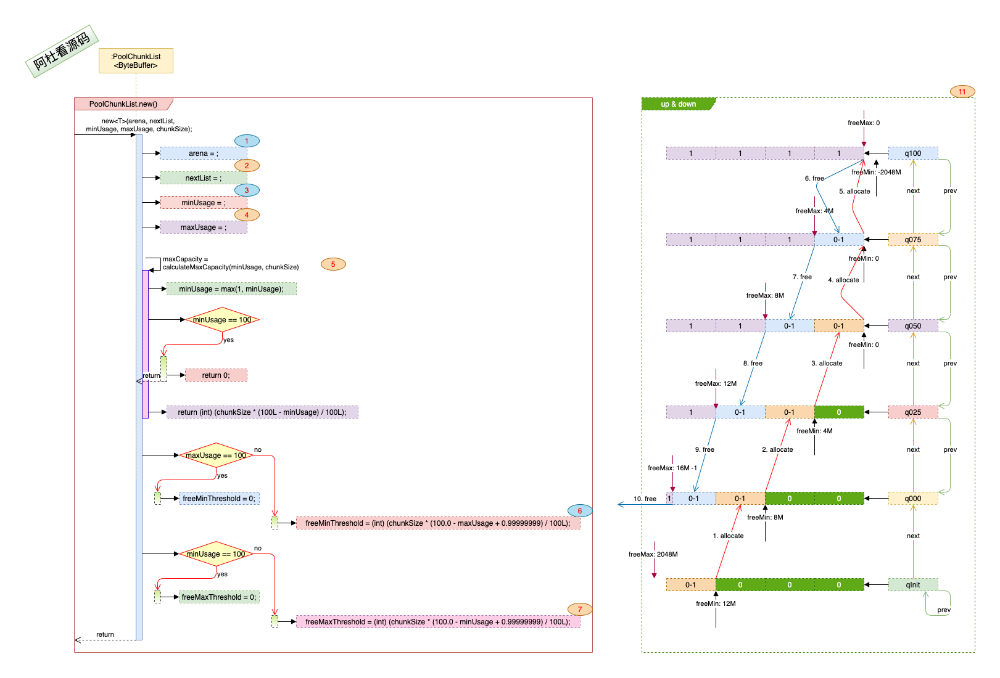
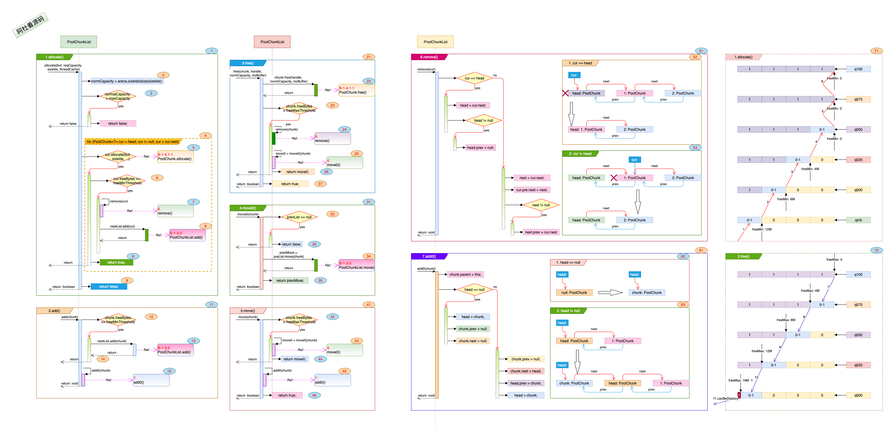

## Netty_PooledByteBuf_4.PoolChunkList

### 一. 干什么?

1. 按楼层下的空置率来进行分级管理, 大远看去一幢楼, 最空旷的楼层在最下面, 最拥挤的楼层在最上面.  
2. 楼层所属的分级是变化的, 空置率变化后, 会在不同的分级间游走. 没血了就回家, 有血了就往上冲.

### 二. 打算怎么干? 

1. 通过定义不同的空置率级别(min, max), 将整个楼分成不同的级别, 第个级别(PoolChunkList)下的空置率都在(min, max)范围内.

2. 随着楼层中空间的分配与回收, 空置率发生变化, 判断是否在不同级别(PoolChunkList)间是升还是降.

   

### 三. 具体实现:

1. #### 先看下初始化方法与数据结构:

   > 
   >
   > - 图中标号: **1**. 属于那幢楼(arena).
   >
   > - 图中标号: **2**. 最高的那一级(nextList)是什么?
   >
   > - 图中标号: **3, 4**. 闲置率的边界的百分比(minUsage, maxUsage). 
   >
   > - 图中标号: **5**. 该分级下最大能满足的空间分配是多少(maxCapacity). 闲置率边界是用来进行分级管理的, maxCapacity表示的是可分配空间, 有可能分配完了, 会进行跳级.
   >
   > - 图中标号: **6, 7**. 计算闲置的边界字节数.
   >
   > - 图中标号: **11**. 一幢楼的分级管理(PoolArena), 从qInit到q100分了6级来管理. 1-5表示随着分配, 楼层的空置率的变化及在不同的分级(PoolChunkList)内上升, 6-9表示随着空间的释放, 空置率越来越高, 在不同的分级中的下降. 
   >
   >   **这里要注意:** 10.free, 因为q000的prev是空的, 所以如果楼层如果空置超过q000的freeMaxThreshold, 16777215----15.9M, 也就是16M空间都是空置时, 该楼层不会下降到qInit, 而是直接从管理分级中移除了. 
   >
   >   | 分级  |  minUsage   |  maxUsage  |   freeMinThreshold   |  freeMaxThreshold   |    maxCapacity    |
   >   | :---: | :---------: | :--------: | :------------------: | :-----------------: | :---------------: |
   >   | qInit | -2147483648 |     25     |  12750684----12.1M   | 2147483647----2048M | 16609443----15.8M |
   >   | q000  |      1      |     50     |   8556380----8.15M   |  16777215----15.9M  | 16609443----15.8M |
   >   | q025  |     25      |     75     |   4362076----4.15M   |  12750684----12.1M  |  12582912----12M  |
   >   | q050  |     50      |    100     |          0           |  8556380----8.15M   |   8388608----8M   |
   >   | q075  |     75      |    100     |          0           |  4362076----4.15M   |   4194304----4M   |
   >   | q100  |     100     | 2147483647 | -2147483648----2048M |          0          |         0         |
   
2. #### 空间的分配与释放:

   > 上图: 
   >
   > 1. 图中标号: **1**, allocate(): 从该ChunkList下的楼层分配空间, 该List下的楼层空置率都在一个范围内, 以链表的结构连接在一起.
   >
   >    - 图中标号: **2**, 根据sizeIdx取空间需求的标准化值.
   >
   >    - 图中标号: **3**, 如果要申请的空间大于该PoolChunkList的最大可分配空间, 那么直接返回分配不了.
   >
   >    - 图中标号: **4**, 扫楼操作: 遍历该List下的所有楼层, 有楼层能分配就直接退出遍历, 返回结果(图中标号: **8** ). 如果所有的楼层都不能满足空间需求, 返回分配失败(图中标号: **9**).
   >
   >    - 图中标号: **5**, 特定楼层(PoolChunk)进行空间分配. 如果分配成功, 检测下该楼层(cur: PoolChunk)还有多少闲置空间(freeBytes), 如果闲置空间少于该分级下的空间率下限(freeMinThreshold), 先把该楼层从本身的列表中移走(图中标号: **7**), 再把该楼层转给下一级PoolChunkList(nextList.add(cur), 图中标号: **8**. 
   >
   >      
   >
   > 2. 图中标号: **11**, add(): 尝试将楼层加入到当前有PoolChunkList中.
   >
   >    - 图中标号: **12**, 如果要加入的楼层的空置空间(chunk.freeBytes)小于最小边界(freeMinThreshold), 则往空置率更小的分级推(图中标号: **13**), 然后直接返回(图中标号: **14**).
   >
   >    - 图中标号: **15**, 如果空置率在范围内, 则将楼层加入到该PoolChunkList管理的楼层列表中(图中标号: **15**).
   >
   >      
   >
   > 3. 图中标号: **21**, free(): 该分级下的楼层进行空间回收, 这里所做的空间回收只是对空间是否使用进行标记, 标记的更改肯定会被执行, free()返回false时, 表示该楼层可以被destroy, 楼层对应的内存可以销毁.
   >
   >    - 图中标号: **22**, 先对楼层进行空间释放, 如果释放完空间后, 闲置的空间大于该分级下的最大值上限(freeMaxThreshold)(图中标号: **23**), 说明该楼层有更大的富余空间, 应该将该楼层进行下移(相对于结构图来说), 那么先将该楼层从该分级(PoolChunkList)的列表中移除(图中标号: **24**), 再将该楼层进行下移(图中标号: **25**, move0()), 返回是否下移成功了(图中标号: **26**), 如果下移不成功, 表明没人要这个楼层了, 这个楼层是全空的, 那这个楼层可以销毁了.
   >
   >    - 图中标号: **27**, 如果楼层释放资源成功了, 也不用对楼层进行下移操作, 则返回true.
   >
   >      
   >
   > 4. 图中标号: **31**, move0(): 因为楼层的闲置空间多了, 向下移动楼层. 
   >
   >    - 图中标号: **32**, 如果该分级的向下分级(prevList)没有了, 那说明这个楼层不能向下移动了, 没人要了, 返回false(图中标号: **33**).
   >
   >    - 图中标号: **34**, 将楼层向下移动, 并返回是否移动成功(图中标号: **35**). 
   >
   >      
   >
   > 5. 图中标号: **41**, move(): 该分级下接收到一个楼层的下移申请, 看能不能接纳它.
   >
   >    - 图中标号: **42**, 先核对一下申请楼层的闲置空间是不是在自己的可控范围内(freeMaxThreshold), 如果不在自己范围内, 尝试对楼层进行下移(图中标号: **43**), 并返回下移的结果.
   >
   >    - 图中标号: **45**, 如果在自己的分级管理范围内, 将楼层加入到管理列表(图中标号: **45**), 返回成功(图中标号: **46**).
   >
   >      
   >
   > 6. 图中标号: **51**, remove(): 将楼层从自己的管理列表中移除.
   >
   >    - 图中标号: **52**, 如果该楼层是head的情况下.
   >
   >    - 图中标号: **53**, 如果该楼层不是head的情况下.
   >
   >      
   >
   > 7. 图中标号: **61**, add0(): 将楼层加入到自己的管理列表中.
   >
   >    - 图中标号: **62**, 如果该楼层head是空的情况下.
   >
   >    - 图中标号: **63**, 如果该楼层head不为空的情况下.
   >
   >      
   >
   > 8. 图中标号: **71**, 随着特定楼层下空间的分配, 该楼层的使用率不断增长, 随着使用率的增长, 该楼层在不同的PoolChunkList分级下从qInit -> q100的过程.
   >
   > 9. 图中标号: **81**, 随着特定楼层下空间的释放, 该楼层的使用率不断降低, 随着使用率的减少, 该楼层在不同的PoolChunkList分级下从q100 -> q000, 的过程, 直至从q000再被踢出来接下来要销毁的过程.

### 四. 写在最后:

1. PoolChunkList管理的楼层列表, 虽然空置率在相应的范围内, 但是每个楼的碎片化不同, 随着时间推移, 空间的分配与回收下, 会有不同程度的碎片, 也就是说即使总的闲置空间能满足需求, 但是却没有连续的空间能真正分配.
2. PoolChunkList的列表管理是非线程安全的.如果在qInit, q000, 等这一级按qInit这些对象进行加锁, 如果管理列表下的楼层很多, 性能是不是会受影响.