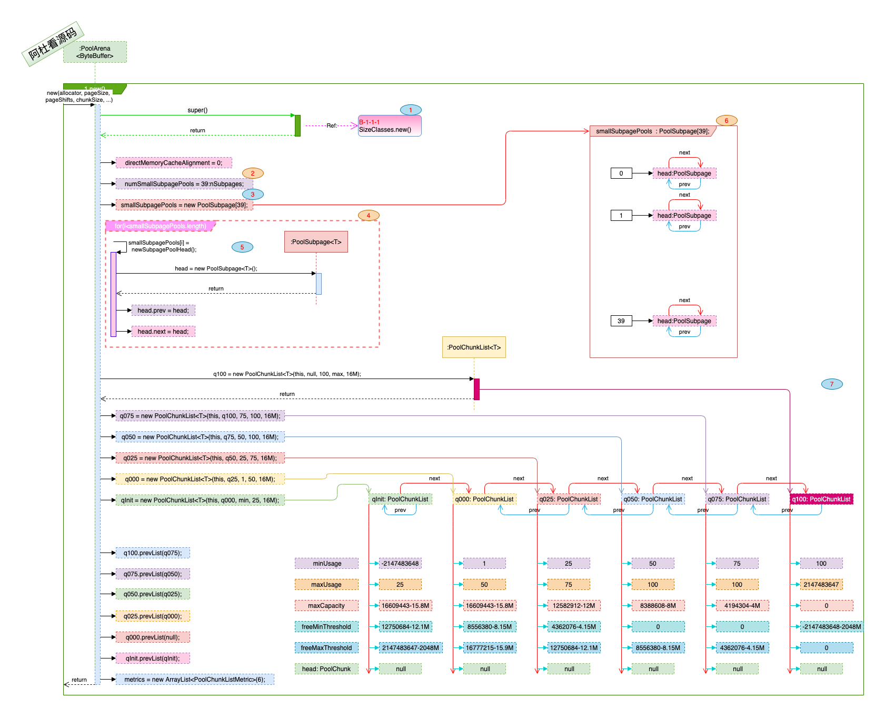

## Netty_PooledByteBuf_5.PoolArena

### 一. 干什么?

1. Soho卖给了黑石, 一幢楼要出租, 不同需求的客户都来了, 有要大面积的, 有要小工位的, 怎么管?
2. 

### 二. 打算怎么干? 

1. 怎么管? 分开管, 分级管. 

2. 随着楼层中空间的分配与回收, 空置率发生变化, 判断是否在不同级别(PoolChunkList)间是升还是降.

   

### 三. 具体实现:

1. #### 初始化及数据结构: 

   > 