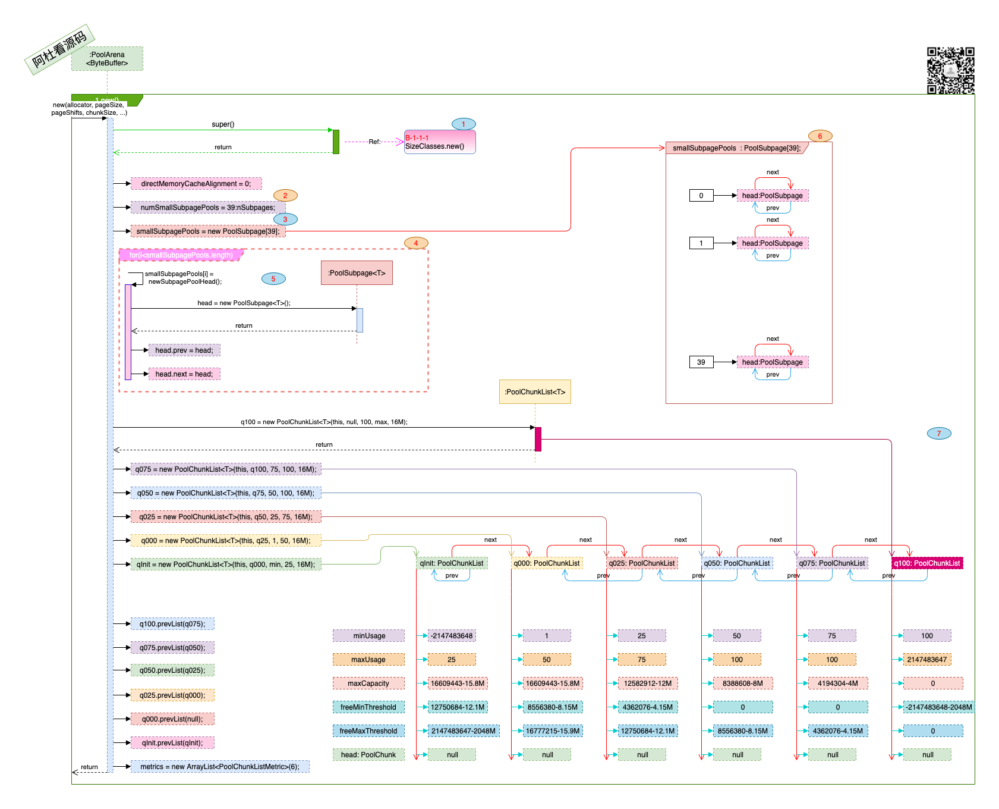
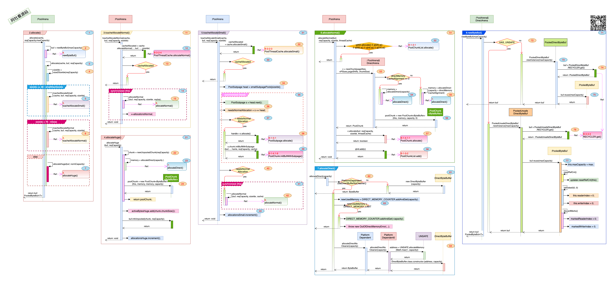

## Netty_PooledByteBuf_5.PoolArena

### 一. 干什么?

1. Soho卖给了黑石, 一幢楼要出租, 不同需求的客户都来了, 有要大面积的, 有要小工位的, 怎么管?
2. 

### 二. 打算怎么干? 

1. 怎么管? 分开管, 分级管. 

2. 分级是什么, 就像买衣服, 码号都标准化了, 170, 175, 180. S码, M码, L码.  177的买什么码, 往大里靠, 买180码.

   

### 三. 数据结构及空间分配与回收:

1. #### 初始化方法与数据结构: 

   > 
   >
   > - 图中标号: **1**. PoolArena继承自SizeClasses, 这样使用SizeClasses中的码表进行标准化.
   > - 图中标号: **2**. 取自SizeClasses中的nSubpages, 共享空间都有那些尺码.
   > - 图中标号: **3, 4, 5, 6**. 共享空间下每种尺码, 都创建了一个链表来管理同等尺码下的共享空间, 默认都是有head头. 这些共享区域可能分布在不同的楼层里.
   > - 图中标号: **7**. 这一幛楼里的每一层, 按楼层的使用率分级到qInit, q000, q100等6个分级下.

2. #### 空间分配:

   > 
   >
   > 1. 图中标号: **1**. 2.allocate(), 空间分配的入口.
   >    - 图中标号: **2**.  PooledByteBuf<T> buf实际上是一个包裹, 里面真正的空间管理由T memory负责, 所以这个包裹可以反复使用(Recycle), 就像酒瓶子一样, 酒喝完了, 用瓶子再装新酒.
   >    - 图中标号: **3**. Allocate(cache, buf, reqCapacity)是最终的分配方法.
   >    - 图中标号: **4**. sizeIdx对reqCapacity空间请求按SizeClasses中的码表进行标准化(房间还分个小户型, 中户型, 大户型). 参看SizeClasses. 
   >    - 图中标号: **5**. 如果要的是小面积, 共享区域中进行分配.  
   >    - 图中标号: **6**. 如果是大面积, 独立区域进行分配. 
   >    - 图中标号: **7**. 超大面积, 联排别墅, 董事长直接接走了. 
   > 2. 图中标号: **11**. 3.tcacheAllocateNormal(), 分配独立空间, 连续的几个房间.
   >    - 图中标号: **12, 13**. 先从cache里看看, 之前是不是有人租了相同面积(sizeIdx一样), 现在退租了, 如果有直接再租出去.
   >    - 图中标号: **15**. 要分配一个新的空间, 那整栋楼都停下来, 只服务于这一个客户- (synchronized(this:arena)).
   >    - 图中标号: **16**. allocateNormal分配独立空间. 
   > 3. 图中标号: **21**. 4.allocateHuge(), 联排别墅的空间分配.
   >    - 图中标号: **22, 23, 24**. 直接分配空间, 不缓存. 
   > 4. 图中标号: **31**. 5.tcacheAllocateSmall(), 共享区域下分配空间.
   >    - 图中标号: **32, 33**. 先从cache里看相同面积(sizeIdx)的有没有退租的, 如果有直接回收复用.  
   >    - 图中标号: **34**. 从smallSubpagePools这个数组里取sizeIdx对应的下标head, 这个尺码的共享区域都在这个链接下.
   >    - 图中标号: **35**.  对head加锁.
   >    - 图中标号: **36, 37**. 如果head == head.next, 说明这个共享区域下, 还没有一个立马能分配的共享区域, 因为head类似一个占位, 初始化时创建, 创建时head.next=head. 
   >    - 图中标号: **38, 39**. 如果已经有可以分配的共享区域(!needsNormalAllocation), 那么就从共享区域里分配一个位置, 并对buf进行初始化(设置那对应那一段内存的读写). 
   >    - 图中标号: **40, 41, 42**. 如果需要重新分配一个独立空间做共享区域, 那就进行分配操作, 记得要对arena加锁. 
   > 5. 图中标号: **51**. 6.allocateNormal() 可以是整租, 也可能是先整租一户再从里租一个床位.
   >    - 图中标号: **52**. 优先从现有的楼层里对处出租, 先从租住率比较高的q050的楼层尝试, 如果从现有楼层里能租到房间, 就算处理完了. 
   >    - 图中标号: **53**. 到这一步, 说明已有的楼层要么都租完了, 要么太挤了满足不了客户的需求, 要新盖一层楼了, 好在新盖大多数情况下也挺快. 
   >    - 图中标号: **54, 55, 56**. 由建筑工人兄弟开一块空间(这里是堆外内存), 再对这空间装修装修(封装成PoolChunk), 好了交付使用吧.
   >    - 图中标号: **57**. 在新的楼层里整租或者合租吧.
   >    - 图中标号: **58**. 新建的楼层跟其它的楼层一样, 按租住率管理起来, 这里qInit.add(chunk)不见得是放在qInit里, 有可能刚刚的用户就租了很大的一户房间, 租住率一下就很高(25%), 那qInit会通过move对该楼层进行传递.
   > 6. 图中标号: **61**.7.allocateDirect(), 分配个空间盖房子.
   >    - 图中标号: **62**. 这里没看明白NoCleaner的意思.
   >    - 图中标号: **63**. 如果分配的堆外内存大于配置的DIRECT_MEMORY_LIMIT, 会抛出OutOfDirectMemoryError异常.
   >    - 图中标号: **64**. 由UNSAFE来分配堆外内存, 并由DirectByteBuffer的Constructor来创建对象.
   > 7. 图中标号: **71**. 8.newByteBuf(), 酒瓶子的创建.
   >    - 图中标号: **72**. 查看是不是用UNSAFE来管理内存. 
   >    - 图中标号: **73, 74, 75**. 由PooledDirectByteBuf.RECYCLER 来获取回收的或者新创建的PooledDirectByteBuf.
   >    - 图中标号: **76, 77**. 由PooledUnsafeDirectByteBuf.RECYCLER 来获取回收的或者新创建的PooledUnsafeDirectByteBuf. 注意这里的reuse处理.

3. 空间回收:

   > 
   >
   > 1. 图中标号: **1**. 1.free(), 不租了.
   >
   >    - 图中标号: **2**. 看看是不是可回收, 如果不能回收, 直接把整个楼层销毁(图中标号: **3**), 适用于超大的空间.
   >    - 图中标号: **4**. 从这合同号(handle)看看是合租的, 还是整租的.
   >    - 图中标号: **5, 6**. 这个房源看看能不能放在业务员手里啊(cache), 每个业务员是可以持有几个房源的啊, 如果可以放在业务员手上, 那就直接返回了.
   >    - 图中标号: **7**.  如果业务员手上的房子已经够多了, 那就去登记一下这个房源是空的了.
   >
   > 2. 图中标号: **11**. 登记这个房源是空的了.
   >
   >    - 图中标号: **12**. 先假定这个房源所在的楼层是不用销毁的.
   >
   >    - 图中标号: **13**. 登记修改的操作, 整栋楼都不能有其它人操作.
   >
   >    - 图中标号: **14, 15**. 这里先记下账吧, 有多少房源收回来了.
   >
   >    - 图中标号: **16**.  由这楼层所属的parent(PoolChunkList)来回收房源, 大体的步骤为: 
   >
   >      a. 不管是整租还是合租, 所属楼层会回收房源, 并更新该楼层的出租率.
   >
   >      b. 楼层的出租率有变化, 会移动到出租率低的PoolChunkList, 如果出租率变成了0, 会从q000中除掉该楼层, 表示该楼层没人管了, 出租率为0, 可以销毁了(destroyChunk = true).
   >
   >    - 图中标号: **17, 18**. 该楼层没人租了, 彻底销毁.
   >
   > 3. 图中标号: **21**. 楼层销毁的细节.
   >
   >    - 图中标号: **22**. 是否用cleaner销毁. 
   >    - 图中标号: **23**. 使用cleaner销毁.
   >    - 图中标号: **24, 25**. 使用UNSAFE销毁, 并更改已经分配的空间数值.

### 四. 写在最后:

1. head链下是不是只有一个还能分配的PoolSubpage, 如果一直调用allocate()方法, 那head后最多有一个可以分配的PoolSubpage, 因为如果PoolSubpage没有空间进行分配了, 就会从head链摘除. 但是在free()释放方法时, 如果释放的是一个已经没有空间的PoolSubpage, 那释放空间后, PoolSupage会挂到head链后.
2. 合租是先整租几个房间, 再把客厅卧室打成隔间进行单独出租.

> 1. 